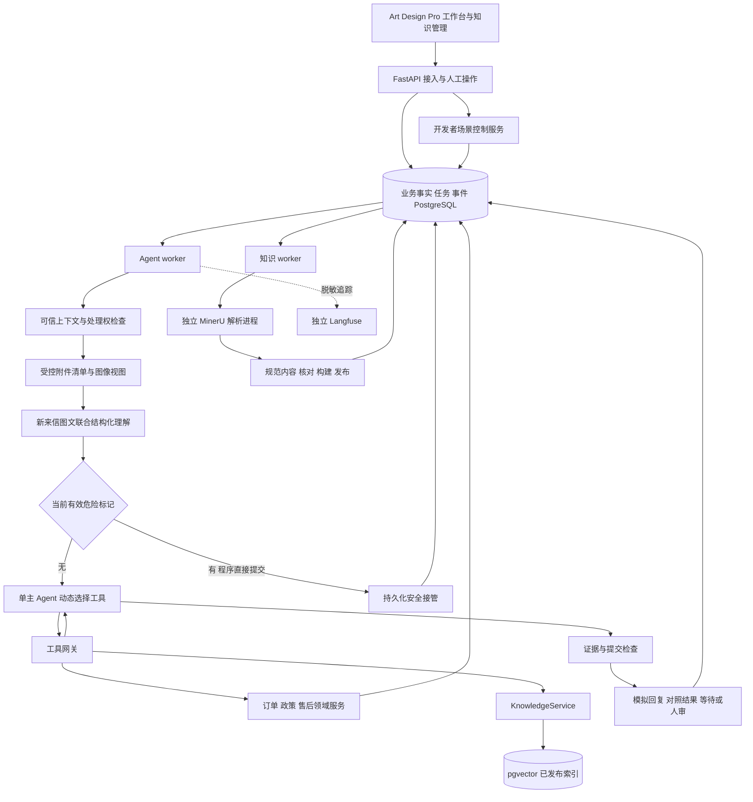
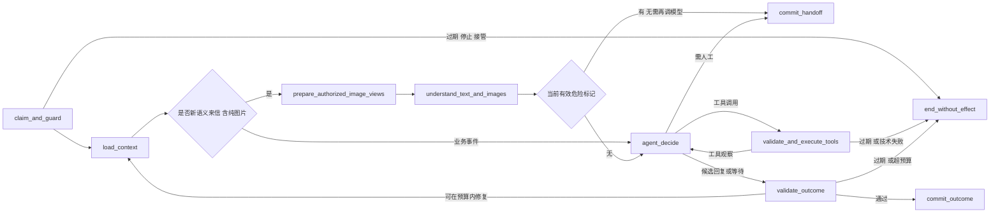

# Agent 架构与运行契约

本文件是根目录的主架构入口；其他专题、验证及交接位置见 [文档索引](docs/README.md)。

版本：v1.1；日期：2026-10-07。依据：Product-Spec v1.13、BUSINESS-SCENARIOS v1.4、TECH-SELECTION v1.3、KNOWLEDGE-DESIGN v1.3 及知识专项实测。

本文是开发设计基线；[Phase 2](docs/verification/PHASE-2-VALIDATION.md)已实现本机系统API、PG/对象依赖基础及前端外壳，其他业务契约尚待分阶段实现验收。技术取舍见 [后端总览](docs/architecture/BACKEND-ARCHITECTURE.md)，逐项验证设计见 [验收映射](docs/verification/AGENT-ACCEPTANCE.md)。具体已实现范围以DEV-PLAN和验证报告为准，其余数据库表、API路由和任务参数仍为工程设计；不改变Spec的业务授权与预算。

v1.0 的独立设计审查已通过，范围见 [原架构审查报告](docs/verification/AGENT-ARCHITECTURE-REVIEW.md)；该报告不涵盖本次客户图片增量。v1.1 补充第4.4节及对应输入、提交、清理和 API 契约，已通过 [图片增量独立设计审查](docs/verification/AGENT-VISUAL-REVIEW.md)：危险分流优先级与旧计数两项发现均已修订复核关闭；正式实现及图片质量仍待验证。

## 0. 本轮规划与完成标准

| 顺序 | 目标 | 完成标准 |
|---|---|---|
| 1 | 核对输入与不变量 | 明确七类业务、历史/模拟隔离、HITL、模型预算和知识实测边界，不重开已确认选型 |
| 2 | 定义状态与执行 | 写清会话、运行、事项、申请、执行单的状态和事件；每个触发可判断是否调用模型 |
| 3 | 定义服务与事务 | 工具输入、返回、授权、幂等、引用和最终提交可据此实现；说明重启/竞争/未知结果 |
| 4 | 对齐知识和工程接口 | Parser、发布、撤销、删除、API/SSE、观测、进程与部署责任明确 |
| 5 | 检查完整性 | 82 个 AC、30 个 SCN、21 个 JRN 及18项待制作 VIS 有验收映射；推演图片更正/删除/晚到、预算及分流故障；不把设计标为运行通过 |

## 1. 系统边界与职责

采用模块化单体：一个业务 API、一个 Agent worker、一个独立知识 worker，共用受控领域服务与 PostgreSQL；MinerU 由知识 worker 启动独立解析进程。初期 Agent 全局并发 1、知识任务并发 1，两类队列互不占用槽位。LangGraph 组织单次运行，Qwen 选择动作，业务服务批准并提交效果。



| 模块 | 负责 | 禁止承担 |
|---|---|---|
| 接入/身份服务 | 导入、手动来信、稳定身份、模式/分支、历史游标 | 用 group_id 或邮箱品牌猜客户/订单归属 |
| ConversationService | 处理权、输入版本、来信、人审、人工结案 | 以模型输出直接覆盖交易事实 |
| ContextBuilder / Understanding | 当前可见原文、结构化理解、来源、预算内压缩 | 读未来事件、参考答案、其他客户或未读附件正文 |
| AttachmentService / VisualUnderstanding | 客户图片接收、受控视图、候选字段/可见观察、来源与覆盖状态 | 自动抓外链、猜根因/责任、凭图授予资格、把客户照片入共享知识库 |
| AgentGraph / ToolGateway | 工具选择、schema、调用预算、结果观察、权限注入 | 接受模型给出的身份/模式/SQL/路径或任意工具 |
| AfterSalesService / PolicyService | 资格、内部申请、数量/额度、取消、对账 | 让自然语言或 RAG 分数授予交易资格 |
| SimulationControlService | 人工推进执行单、仓库、支付和物流事件 | 注册为 Agent 可调用工具，自动灌入未来成功结果 |
| KnowledgeService / IngestionService | 规范内容、适用绑定、构建、发布、检索与撤销 | Agent 修改全局政策，未经核对直接发布 |
| CommitService | 原子保存最终结果、引用资格、一次出站 | 发送流式半成品，先检查后无保护写入 |
| JobService / LifecycleService | 租约、去重、停止、显式恢复、清理与重建 | 因刷新页面或补 trace 再跑业务 |

真实 ERP、真实发信和财务操作无适配器、无可调用工具。未来接入必须单独补授权、幂等和未知结果对账，不能仅更换 URL。

## 2. 可信运行上下文与数据分区

`RunContext` 由 worker 从数据库创建，以服务端依赖注入传给工具；不属于模型可写参数，所有字段也由最终提交重新读取核验。

| 字段 | 约束与用途 |
|---|---|
| workspace_id / dataset_id / branch_id / branch_generation | 当前运行集合；重置递增 generation，旧任务不能写回新分支 |
| conversation_id / customer_id / access_scope_id | 从身份及导入关系取得；每个订单/操作都再次验证归属 |
| mode / knowledge_mode / data_split | UI 模式与知识用途分开；simulation 分支映射 `simulation`，历史映射资料允许的 `historical_eval`；开发查询的 dev 不等于允许读取 eval_holdout |
| as_of / visible_message_seq / input_revision | 历史来自当前游标；模拟来自分支时钟与当前已接收输入，均不能由模型推进 |
| authority_epoch / branch_generation | 接管、停止、结案、删除等撤销执行资格的栅栏 |
| trigger_id / run_id / processing_cycle_id / attempt_no | 同一触发的重试保持 cycle，不生成新的出站资格；新客户输入产生新 cycle |
| agent_slot_fence / lease_owner / lease_expires_at | 当前任务执行资格；租约过期或 fence 变更后只允许记录安全诊断 |
| release_id / release_epoch / embedding_profile_id / policy_version | 一轮使用的知识快照和模型空间；政策仍按业务适用条件确定，并在写前重验 |
| attachment_manifest / evidence_epoch | 当前可见消息的获准附件ID、内容/预处理摘要、修订与用途；更正/撤销使epoch递增，外部字段变更也递增input_revision；本轮正常写分析结果不自行递增输入版本 |
| prompt_version / tool_schema_version / graph_version / budget | 可复现配置，不允许模型修改或通过重试归零 |

身份键为 `(workspace, dataset, mode, branch, verified_sender_key)`；手工邮箱 trim、规范化域名，不擅自删除加号/句点或合并不同本地部分。无可信 sender_key 的真实来源以独立源会话回放，显示身份未验证。`group_id` 仅限制资料用途，不替代身份。

历史每个截点重建 CaseState、Understanding 和模型消息；上一轮 AI 对照及人审对照回复不进入真实前缀。浏览器接口同样只返回已展开的真实消息。历史工具不读模拟分支，缺少当时订单/资料即返回不可用；当前 22 份 simulation 知识不能通过改 mode 参数进入历史。已有业务写工具不注册到历史模式，网关和领域服务仍做二次拒绝；历史运行可保存本轮对照、候选案件状态及人审结果。

## 3. 状态模型与事件矩阵

### 3.1 会话状态不挤进一个枚举

| 维度 | 状态/字段 | 真相来源 |
|---|---|---|
| 生命周期 | `open / resolved / deleting / deleted` | 人工结案与清理事件 |
| 处理权 | `agent / human_review / human_wait_customer` | HumanReview 与接管记录 |
| 自动唤起门禁 | `open / manual_retry_required / disabled` | 停止/中断、删除及显式重试 |
| 调度投影 | `idle / queued / running / waiting_customer / waiting_business / failed / stopped` | 当前 run、未处理输入和 WaitCondition 的可重建投影 |
| 版本 | `row_version / input_revision / authority_epoch / case_revision` | 数据库递增；各自含义固定 |

`row_version` 供 UI 乐观并发；`input_revision` 只由新来信、相关业务事实或人工事实修订等外部上下文变化递增；`case_revision` 由本轮经校验的记忆更新递增，不让 Agent 自己写记忆导致自己整轮失效；处理权变更同时更新 `authority_epoch`。工具读到的订单/操作/地址/库存版本另记在依据中。

多个订单/问题属于同一 Conversation，使用 `CaseIssue` 关联订单行、问题证据、尝试步骤、方案与等待。模型可以提议事项关联，服务端确认/复用稳定 issue_id；新造 issue_id 不能绕过订单行补偿约束。所有等待可并存，页面优先显示人工接管/运行/错误，再显示各项等待。

### 3.2 接收事件和唤起规则

| 事件 | 条件 | 原子处理与是否唤起 |
|---|---|---|
| customer_message.accepted | open + agent | 消息去重、递增输入版本、旧未提交 run 失效；排队一个处理当前可见输入的任务 |
| customer_message.accepted | human_review | 追加并提示，保持接管，不排自主任务 |
| human_reply.completed | human_review，UI 已覆盖最新输入版本 | 保存人工模拟出站和备注，转 human_wait_customer；不调用模型 |
| customer_message.accepted | human_wait_customer，接收序号大于人工回复屏障 | 清除屏障与旧门禁，转 agent；从最新事实建立新 cycle/run |
| operation.result_changed | agent + gate=open，匹配WaitCondition或关联本会话尚在处理的内部申请/事项 | 保存事实、递增输入版本并登记持久wake_pending；即使wait尚未注册也排后继任务。当前run失效，多次更新可合并到最新状态 |
| operation.result_changed | human_review / human_wait_customer / resolved / gate关闭 | 只更新账本与提示，不排自主任务、不发信 |
| stop / takeover / human_close | 任意未删除状态 | 撤销 authority_epoch 和运行资格；停止不抹除已提交操作；接管、结案分别改变处理权/生命周期 |
| customer_message.accepted | resolved | 按 ASM-007 重开原会话，保留结案事件，启新 cycle |
| customer_message.accepted | failed / stopped / interrupted 且无 HITL | 新输入建立新 cycle，可重新处理；旧未知操作必须先查；旧停止 run 不复活 |
| explicit_retry | failed / stopped / interrupted，仍有自动处理资格 | 关联原 cycle、读取最新事实与原操作；重建新 run，不直接继续旧工具参数 |
| replay.next | historical_replay，当前运行已终止 | 推进一个真实客户截点，重建独立本轮上下文；无消息则显示结束，不结案 |
| reference.revoked / knowledge.published | 任意 | 不凭知识维护事件自动给客户发信；运行中的检索/写入/提交门检出失效 |

人工回复事务锁会话并检查 `expected_input_revision`。若另一封来信先提交，回复返回 409 并提示重新核对；若人工回复先提交，之后接收的新来信才满足恢复屏障。恢复以本地持久接收序号判断，不以可伪造的邮件 Date 倒推。

等待记录为 `(issue_id, operation_id?, condition_type, last_seen_business_version, owner, status)`；条件类型包括客户信息、人工执行、退款回执、仓库收件/质检、库存、包裹变化、需要人审。业务事件无新版本/不满足相关性，不调用模型。业务暂停不保留跨天模型请求或数据库事务。

等待注册与业务事件接收都按统一顺序锁Conversation及关联Operation，不能依赖“事件到达时wait已经存在”。终局保存wait前比较最新业务版本/条件与本轮last_seen；若结果已变化或条件已满足，在同事务保存wake_pending及唯一后继触发，并按当前输入版本拒绝过时草稿/等待结论。事件先到靠注册时补查，wait先到靠事件唤醒，两种顺序都必须覆盖；无需后续再来一个事件才能继续。wake_pending只有被新run实际观察并提交结果后才能消费，排队本身不算消费；人工屏障期间保留事实但抑制任务，下一新客户来信加载全部最新事实。

### 3.3 运行、内部申请与执行单

`AgentRun`：`queued → running → completed / handed_off / failed / budget_exhausted / stopped / superseded / interrupted`。等待是本轮 completed 的 outcome（reply_and_wait、wait_business、historical_comparison、no_material_update），不是悬挂运行。重启时曾 running 的旧任务标 interrupted，关闭自动重试门；未领取的 queued 任务经资格复核后可领取。

`AfterSalesOperation`：`accepted → waiting_condition / awaiting_execution → processing → succeeded / failed / unknown / cancelled`。accepted 仅表示内部申请及必要补偿额度预留；执行单状态通过服务投影关联，不由模型写 succeeded。failed/unknown 默认保留占用，确认未执行且可释放后才释放；unknown 必须对账。取消仅在未执行或确认可撤销时生效。

`ExecutionRecord` 独立记录支付尝试/退货单/换货补发单；同一 operation 可有多个尝试，但同一时刻最多一个未确定尝试。支付成功凭回执、发货凭承运揽收/出库事实、收件/质检凭仓库记录；`created / label_created / shipped / delivered / inspected` 不能互相替代。客户问题解决始终由人工结案。

## 4. LangGraph 与上下文契约

### 4.1 固定骨架、动态工具循环



新来信批次先完成一次结构化 Understanding，含多诉求、消息行为、对象候选、条件、具体同意、缺失信息及 message_id/原文位置；有获准图片时同一节点联合图片输出视觉证据（第4.4节），无图不加视觉请求。条件退款与立即授权分开，正文或截图称“已退款”均记作客户材料；订单/SKU 由工具证实。工具可修正理解，每次变更保留来源。已知业务事件直接从其 operation/wait 关联进入决策，不再额外分类。

GraphState 保存可信上下文引用、理解结果、模型消息、工具调用/证据 ID、已提交操作 ID、草稿、等待提案、预算账本引用和结束原因。跨轮事实以 PG CaseState/Message/业务账本为准；State 不成为另一套交易数据库。`thread_id=run_id`，每次新运行独立检查点；采用 PostgreSQL checkpointer 与 `durability="sync"`，数据限制为受控可序列化 schema，不启用任意 pickle 反序列化。

CheckpointRepository 对框架的checkpoint及pending-writes入口统一加持久写栅栏：以thread_id查询run及branch_generation、checkpoint_writable、关联知识/图片撤销状态与evidence_epoch，并在同一数据库事务/统一锁序内校验后调用绑定该事务连接的持久化实现。不能先检查再让默认saver用另一连接无保护写入；锁定包的连接/事务兼容性必须在实现阶段验证。接管/删除关闭checkpoint_writable；正常终局允许最后一个检查点落盘后关闭。检查点失败不回滚已提交业务，重启以cycle/账本判断真实结果。

HITL 保存 HumanReview、撤销处理权并结束图。人工回复不调用旧图的 `Command(resume=...)`；下一封新来信或技术显式重试重新建图。框架检查点用于诊断和本轮正常节点推进，不承诺业务事务和检查点同时成功。框架的重放可重新执行后续节点，所有副作用仍走业务幂等门。[LangGraph 检查点与持久化模式](https://docs.langchain.com/oss/python/langgraph/checkpointers)、[中断的副作用重入规则](https://docs.langchain.com/oss/python/langgraph/interrupts)

### 4.2 上下文组成与来源

按系统行为/可信模式 → 当前来信 → 关键结构化事实与未完成事项 → 相关可见原文 → 当轮工具证据组织。16k 输入预算下预留约 4500 tokens 给知识，优先保留订单绑定、客户选择/金额币种、失败步骤、人工决定、地址版本、操作号及等待条件；这些信息不能被自由摘要覆盖。

事实记录 `{value, kind, source_refs, valid_from, supersedes, verified_by}`，kind 区分 customer_report、historical_claim、visual_observation、tool_fact、human_decision、model_inference。visual_observation只是模型对客户图片的观察，不提升为鉴定或账本事实。记忆摘要含 `covers_message_seq / source_hashes / case_revision / evidence_epoch`，不作业务授权；旧摘要缺关键来源时回取可见原文。删除或撤销资料/图片后，与其相关的推断/摘要也必须失效；运行重新构建上下文时去掉旧内容。

邮件正文、图片/图中文字、检索内容、人工自由备注都是数据，不改变工具和访问范围；人工结构化决定通过 UI 服务写入，不由自由文本赋予无限权限。获准且具备字节的客户静态图按第4.4节输入；其他附件只传元数据、真实状态与 `content_unread=true`。目录视频不得自动访问或声称观看。原始未复核生产正文/图片、完整故事、后续控制事件、reference_reply、holdout 答案无加载路径。

### 4.3 预算、无进展与失败

严格沿用 ASM-005/006：一轮最多 6 次模型请求、12 次工具调用、120 秒；每次输入 16k、输出 2k，累计输入输出 80k，网络超时 30 秒。同工具同参数连续 2 次且结果版本/信息未变化，停止无进展循环。理解、格式修复、重试、摘要和可选语义核验均计入；不能借 LangGraph 内置重试暗增次数。

请求前 PG 原子预留请求次数与预计输入/最大输出，响应后按实际 usage 结算；无 usage 记 unknown 并保留保守预算占用，费用保持未知。超时/429/临时5xx 最多额外尝试 1 次，退避和请求仍受剩余预算限制；401/403/schema配置错误不自动重复。工具只读重试也计调用；写入超时先查询原操作，禁止靠重发换 key 探路。

同一触发的显式重试使用新 run 但关联原 cycle 的已消费预算；耗尽显示预算不足，不自动创建新 cycle 逃逸上限。仅新客户输入/合法的新业务事件产生新的业务轮次；人工以后若调整预算，必须更新配置和审计。120 秒计算本轮实际活动耗时，等待人工/离线停机不占持续运行时间，当前 attempt 超时立即收口。

普通技术解析/连接失败为 failed，超预算为 budget_exhausted；保留材料与显式重试入口，不伪造成功或默认业务类型。例外优先级：当前有效输入已形成经schema/来源校验的危险标记时，直接执行第4.4节确定性安全接管，后续技术错误/额度不足不得把其覆盖为无人审的普通失败。业务上缺一个订单等可补字段则正常补问；没有可靠下一步则 handed_off。停止尽力取消网络请求，并通过事务栅栏拒绝无法取消的晚到响应。

### 4.4 客户图片：输入、视觉证据与售后分流

本节对应 REQ-014。继续使用已选 Qwen3.7-Plus 的视觉输入及结构化输出，不增加视觉 Agent 或默认 OCR 服务；官方能力与本项目单页读图烟测见 [TECH-SELECTION.md](docs/architecture/TECH-SELECTION.md)。客户图片故障识别、图文结构化联合调用质量及真实时延尚未专项验收。

**输入接收与处理阶段**

1. `AttachmentService.stage` 在当前会话/模式/分支内保存服务端分配对象，验证实际 MIME、解码尺寸、静态帧和摘要；支持 JPEG/PNG/静态 WebP。初值每封4张、单张10MiB/20百万像素、合计20MiB，超限整项明确报错，保留用户草稿；知识 PDF 的50MiB/300页限额不适用于客户图片。
2. 接受消息时一次性绑定已就绪 staged IDs、正文/CID 映射与不可变清单，校验归属及未被其他消息占用，消息去重沿用payload_hash。正文可空但须至少一张受支持已接收图；元数据缺字节可随有正文的邮件保存为missing。未提交暂存初值24小时清理，清理须再次验证无消息引用；重发/补图作为新来信，不原地替换历史图片。
3. 图片进入 `ready → processing → understood / partial / unreadable / failed`，另有 `missing / unsupported / revoked`；understood表示已产生分析，不表示业务核验正确。processing绑定run/fence，进程中断后标技术中断，跟随原cycle显式重试，不由附件完成事件独立唤起Agent。上传预览不触发VLM，HITL期间只收图，不自动分析或发信。
4. `prepare_authorized_image_views(ctx)` 检查身份、用途、消息可见时间、当前撤销状态与摘要，进行方向校正、受限缩放/无生成式裁剪，保留派生配置及坐标变换。首轮使用保留细节的受限全图视图；字太小可在剩余预算内局部复核。全轮最多6个模型图像视图（含重复/裁剪）；全部活动时间计入120秒。无法覆盖所有相关图时保留逐图未读范围，不用局部成功声称全部已读。
5. `VisualUnderstanding` 与正文/历史联合构造一次理解请求。先保守预留文本+视觉tokens+最大输出并记次数，不能用base64长度或纯文本token数冒充视觉用量；供应商估算适配待实验验证，无可靠上界则拒绝超预算风险请求并提示缩小/减少图片。响应按实际usage结算，缺失保持unknown与保守占用；局部复核、修复、重试均共享6次模型/12次工具/120秒及原token上限，不另开隐形额度。

图片字节仅在模型适配器临时组装到获准的百炼请求；GraphState、业务结果、checkpoint不保存base64或可访问URL，使用AttachmentRef替代，确需重读时重新授权取图。回调在进入观测队列前去除原图/二进制/URL及敏感提取正文，不能依赖Langfuse入库后再遮盖。无图片路径与旧纯文本流程一致。

**结构化输出与引用**

`VisualAnalysis` 包含 analysis_id/run_id、model与prompt/预处理配置、context_hash、attachment_manifest、逐图coverage与quality、field_candidates、observations、hypotheses、uncertainties、risk_flags。字段候选保留raw_text、value、ambiguous_characters和来源；未知为空，不合成“最可能订单号”。观察例“灯罩边缘疑似裂纹”与推测例“可能运输受损”分栏；风险标记用于安全分流，不表示鉴定结论。不保存隐藏推理链或将自报置信度当真值。

`VisualEvidenceRef` 包含 evidence_id、message_id、attachment_id/revision、source_sha256、derived_view_hash、analysis_id、evidence_epoch、kind、原图位置、业务核验/人工修订关联。位置优先为实际裁剪区域/可核对框；无法可靠定位时使用整图并标明，不伪造精确框。字段/观察/推测均能打开对应原图，后续人工更正产生新EvidenceRevision且记录supersedes，不覆盖原始分析。

缓存仅在同客户/模式/分支/用途/历史截点、原图/预处理/模型/Prompt、语义上下文context_hash、evidence_epoch均相符且依赖仍有效时复用；context_hash覆盖模型实际接收的可见文本/结构化事实/图像清单及相关版本，不只哈希最后一封。默认不跨run复用联合理解，先保证正确再优化。历史允许现在分析当时可见且受控可用的原附件，但区分source_available_at与analyzed_at；不得复用含后来消息/补图/人工判断的分析。分析内容不自动入公共RAG或训练集。

**分流与业务授权**

| 观察或缺口 | 下一步及程序检查 |
|---|---|
| 订单/标签可读 | 当前客户范围精确查单/核验SKU，歧义或图文冲突先澄清；不能模糊遍历猜单 |
| 可见破损/安装问题且商品已核验 | 检索适用SOP并核对客户诉求；有依据则指导或按政策提交内部申请，不强制一律人审 |
| 外观正常、拍摄局部或反光 | 保留客户功能故障陈述；未见不是无故障/无缺件的证明，按缺口索取必要信息 |
| 疑似烧灼/熔化或客户危险描述 | 有效风险标记直接由程序提交HITL，不等查单或额外决策模型，不因余量不足/后续调用失败而漏接管；仅使用已核准安全指引，不索取通电/拆机验证 |
| 截图写退款/发货、金额或承诺 | 作为客户材料，查业务回执及政策，禁止直接更新交易事实 |
| 技术失败、缺字节或不可读 | 技术失败为failed并可显式重试；缺字节/不可读可正常补问；未读关键证据不支持依赖它的指导或申请 |

`PolicyService` 对每项资格保留 `evidence_requirements`（允许的来源kind、人工确认或工具回执要求）及fulfilled_by引用；既有模拟政策缺此映射时不得将visual_observation静默当tool_fact，相关条件返回needs_input/requires_review。图片可以支持政策明确允许的客户申报/可见外观条件，但订单、兼容、金额、客户具体选择、前置履约和冲突仍由原服务核验。暂不修改当前fixture政策，正式实现时补版本化规则与样本。机器能校验schema、来源、状态及动作权限，视觉语义正确性仍需图片专项人工标注/回归。

安全接管提交具有高于普通failed/budget_exhausted的终局优先级，但不能越过停止/输入过期/删除/人工处理权。Understanding产出有效risk_flags时，在同一短事务内保存有来源的风险记录、建立/复用HumanReview、撤销自动处理权并将run标为handed_off；不能先单独提交风险、再依赖agent_decide调用模型创建人审。已有有效风险进入load_context时同样先检查此门。预算已用完也允许该必要持久化收口，不新增模型/工具请求，不生成未经依据的安全话术；附带技术错误单独记录，不覆盖handed_off。对从未获得有效风险标记的纯图解析失败保持failed，不凭空判危险。若数据库提交失败，业务未提交则不得继续执行，需持久任务恢复/显式重试重建受控上下文；不能把未落库的人审展示为已成功。

风险记录带 `active / resolved_by_human / corrected_by_human`、来源和人工决定引用；“已有有效风险”指仍active且依据未撤销的记录。人工可在已接管且版本有效时明确记录已处理/误判及依据，生成修订；仅点完成回复不自动清除风险。后续新来信使用最新人工修订，不能因旧模型缓存反复恢复已被人工纠正的风险，也不能让模型自行清除未处理风险。

**并发、更正及完整删除**

- 接入、预览、提取结果落盘、工具使用、写申请和最终回复均复核Attachment归属、修订、evidence_epoch和依赖；并发锁序见6.3。本轮正常分析结果写入只更新分析状态/案件修订，不让自己input_revision失效；每次落盘仍需run/fence资格。新来信/人工更正/撤销等外部输入使旧run失效，旧VLM返回只能丢弃内容并记录无正文诊断。
- 人工更正入口要求人工处理权（否则先显式takeover），带expected_input_revision及evidence_revision。更正递增evidence_epoch/input_revision，不自动生成run、不解除human_review或human_wait_customer；下一封客户来信才恢复。候选字段核验不会无来源地覆盖人工版本。
- 移除已提交图片先在持有Conversation及Attachment行锁的事务撤销、递增epoch/input_revision并关闭依赖运行的checkpoint_writable；与最终回复/业务写争用同组锁。先撤销则拒绝旧提交；先提交则保留已发生业务账本，再清理项目内含图片内容的产物。撤销/清理不唤起新业务轮次。
- 彻底删除复用DeletionRequest与独立删除journal：原图、缩略图/裁剪、字段/观察/推测、缓存、已暴露给模型的上下文/摘要、checkpoint/pending-writes、草稿/模拟回复和本地trace均登记content_dependencies。无法细分则清理整个依赖run的内容；多来源摘要重建只能用仍获准来源，已提交操作保留无正文ID/状态防重复。
- CheckpointRepository、摘要/结果写入及观测导出均检查图片撤销epoch和删除栅栏；清理先停止在途写者、丢弃内存图片/派生内容，再清理并验证。清理失败不显示完成，重启/备份恢复在开放读取前应用最新删除journal。共享物理对象只有在所有有效引用已分别解除/安全转移后才能物理删除，范围不清时blocked_dependencies，不能误删其他会话。外部原文件、供应商保留和离线备份按范围分别说明，不能宣称全部远端已删除。

## 5. 工具契约

所有模型工具 schema 禁止额外字段，参数长度和枚举校验；身份、模式、分支、split、时间、政策选择范围、幂等标识由 ToolGateway 注入。对模型提供的 order_id/SKU 等对象参数逐次校验归属与注册关系；不可把“上下文里有这个 ID”当作充分授权。

统一 `ToolResult`：`status`（ok/empty/needs_input/denied/conflict/unavailable/unknown/error）、`reason_code`、类型化 `data`、`evidence_refs`、`observed_at`、`resource_versions`、`source_kind`、`simulation`、`retryable`、`existing_operation_id?`。empty=确无记录；historical_unavailable=当时不可用；error=技术失败；unknown=无法确定是否已经执行，不能互相替代。

| 工具 | 模型可给的主要参数 | 类型化结果与执行边界 |
|---|---|---|
| get_case_context | visible_message_ids?、issue_ids? | 当前可见原文/关键事实/待办及获准视觉证据ID/逐图状态；拒绝游标以外消息，不返回任意路径/base64，返回截断与覆盖范围 |
| get_order_snapshot | display_order_number | 当前身份订单行、精确SKU、品牌、金额、数量、来源和snapshot_at；多商品不自动选第一行 |
| get_shipment_status | order_line_id、operation_id?、shipment_id? | 逐个包裹、原件/退件/补寄关系、状态/时间/来源；不按订单取第一条补发 |
| get_after_sales_context | order_line_id、issue_id、action_types[] | 现有申请/执行/占用、可适用政策版本及缺失条件；历史无适用政策保持未知 |
| get_item_availability | order_line_id、target_sku/part_id、region_spec | 精确兼容、版本化库存、unknown/missing；该次有货不保证履约时有货 |
| check_after_sales_eligibility | issue_id、order_line_id、候选方案、数量、金额最小单位/币种、consent_ref、address_ref? | `eligible / needs_input / wait / requires_review / ineligible`、条件、规则ID及 decision_id；由服务复算，decision非永久令牌 |
| create_after_sales_operation | decision_id、规范方案参数、selection_ref | 复核最新版本后创建/复用唯一内部申请；返回operation_id、accepted、等待条件；不创建ERP单 |
| get_operation_status | operation_id 或经验证的订单行+事项查询 | 原申请、所有关联执行尝试、未知结果、物流及版本；写超时先查此接口 |
| cancel_after_sales_operation | operation_id、客户改变选择的来源、expected_operation_version | 返回 cancelled/不可取消/需对账；未知不能释放占用并重建冲突方案 |
| search_reference | query、已绑定order_line_id/sku、document_types[] | 当前发布快照内的证据列表、缺口、解析完整性；服务端过滤后排序 |
| update_case_state | 有来源的事实/步骤/选择/等待变更、expected_case_revision | 只更新案件候选与已核验事实，不能写交易成功、库存、处理权或全局规则 |
| create_reply_draft | 语言、正文、claims[]、citation_ids[]、waiting_proposal | 保存当前run候选，不发送；claims关联来源类型和事实/步骤ID；最终CommitService再校验 |
| request_human_review | 原因枚举、缺口、来源、摘要、可选未发送草稿 | 原子建立/复用HumanReview并终止自主运行；不再调用“发送” |

首版工具逐个执行，模型一次产生多个调用时按声明顺序逐一校验；每个写操作重新读取状态。后续只读并行需证明无依赖再启用；当前不增加此复杂度。所有业务写均附 `request_payload_hash` 与服务生成的 command_id；模型的 tool_call_id 仅关联一次调用，不是业务幂等键。

## 6. 事务、幂等与故障恢复

### 6.1 四种重复必须分别拦截

| 重复来源 | 唯一约束或事务规则 |
|---|---|
| 导入/按钮重发 | `(scope, request_id)` + payload_hash；同键异参409，同键同参返回原资源 |
| 同一来源事件重复投递 | `(branch_generation, source, source_event_id)`；事件记录与任务/处理标记同事务 |
| 检查点重放/新run再次提出相同申请 | 持久化command_id、规范方案摘要；按订单行/受影响数量查所有既有操作，复用原申请或拒绝冲突，不仅按新UUID去重 |
| 同一业务轮次多次生成最终结果 | 最终outcome对 `processing_cycle_id` 唯一，每cycle最多一封自动出站；草稿可以多版，历史结果不进入Message |

命令先登记规范参数/源证据、稳定command_id及known operation映射。重放时先查已提交结果；检查点缺失不会丢此映射。业务请求实际效果、额度/数量占用、operation、事件及工具结果凭证在一个业务事务中提交；图检查点另行保存。读已完成凭证仍需当前身份权限，不能借幂等查询跨客户返回内容。

金额一律最小货币单位整数并明确币种，禁止自动换汇。退款可用额为实付减成功退款减处理中/未知占用，不能把同一申请与其执行单重复计扣；多数量按订单行中的明确受影响份额关联，无法确定不同方案是否覆盖同一份额时澄清。补件与退款/换货的冲突检查跨run、跨issue_id查看同一订单行的现有补偿，不允许换ID绕过。

内部申请预留补偿额度/数量，不预留“ERP库存”。场景控制台创建模拟履约记录时锁实际分支库存行，校验当前库存/地址确认/兼容/申请状态，再原子预留库存、生成执行记录及事件。库存不足可等待，不因早先查询有货而强行成功；地址版本变化使旧确认失效；取消、失败释放与重试使用同一占用账本。替代型号按现有政策要求客户明确选择、兼容校验和人工处理。

### 6.2 任务租约与停止

Agent 任务领取使用短事务、`FOR UPDATE SKIP LOCKED` 和数据库 AgentSlot 单槽租约；该机制用于队列，不能用于业务正确性查询或跳过被锁订单。[PostgreSQL 队列行锁语义](https://www.postgresql.org/docs/18/sql-select.html)

工程初值：Agent 心跳10秒、租约60秒，知识心跳15秒、租约90秒；均使用数据库时钟与单调递增 fence。领取后不持有事务等待模型。每次请求前及副作用事务检查租约、gate、generation、input_revision和authority_epoch；心跳失败立即停止新调用。旧网络调用可能仍返回，不能保证供应商侧瞬间取消，数据库栅栏保证其无新增效果。

租约过期的 Agent 任务只标 interrupted，必须显式重试；普通后台等待不是技术重试。知识解析/Embedding等可重建任务可自动重试最多3次、退避2/10/30秒，检查删除栅栏与输入摘要后复用部分产物，绝不自动发布。知识 worker 只使用隔离子进程，超时终止本次进程树并保留失败阶段。

`queued`任务的输入被新来信替代时，合并其待处理事件ID并仅保留最新上下文任务；已运行者置superseded，保留已经发生的操作，新run从账本重新读取。每个事件有 pending/processed/suppressed_by_human 标志，完成与结果同事务；历史事件不会因取消队列而失去事实。

### 6.3 统一锁顺序与最终提交

会话变更若可能撤销Agent和知识两类任务，先按agent→knowledge顺序锁定相关任务槽，再取会话锁；worker提交只取自身任务槽再取会话锁。不能持有会话锁后再补取另一类任务槽。槽行锁仅在短事务持有，知识与Agent的长期租约仍相互独立。

涉及自动副作用的短事务按存在的资源依次锁：AgentSlot → SimulationBranch/运行集合栅栏 → Conversation → MessageAttachment/EvidenceRevision（ID排序）→ KnowledgeReleaseHead（scope排序）→ OrderLine（ID排序）→ Operation/Execution → Inventory（ID排序）→ Run/Task/结果行。领取/心跳只锁slot和task后结束，不再反向获取业务锁；人工图片更正/撤销从分支及会话开始按相同顺序，不能持附件锁回头锁会话；发布只锁knowledge head及知识对象，不在持锁期间回头锁会话。清理跨域拆成有栅栏的多个任务，不能反向嵌套锁。

最终提交必须在同一事务内完成：

1. 核对slot fence/lease、分支未删除、处理权agent、输入版本/authority_epoch仍匹配，run未停止且cycle未出站。
2. 先复核本轮已使用的图片清单/摘要、撤销与evidence_epoch、分析/人工修订及覆盖状态，再锁当前发布头与相关文档资格，确认引用版本/范围/时间及政策说明和规则同版；校验引用内容摘要，验证依赖的业务记录仍支持草稿的执行声称。只复核最终引用不足，所有暴露给本轮的图片依赖均须有效。
3. 资料或业务版本变化时返回stale_context，**不写最终邮件**。知识变化可在剩余原预算内最多重建上下文一次，丢弃旧知识消息/摘要再检索；仍无法得到依据则人审，技术不可用则failed。新客户输入/接管使整个run superseded，由事件规则处理后继run。
4. 验证Draft语言、必需来源、金额/币种/数量、步骤适用性、逐图未读/部分覆盖、视觉观察与推测分层、未执行动作与结果状态。资格decision包含满足政策所需的证据类型，不能仅凭图片分数授权。涉及模糊自然语言含义可用预算内模型核验；程序检查不是对全部自然语言或视觉正确性的形式证明，仍需业务回归/人工评分。
5. 原子写 ReplyArtifact + simulation Message（或历史对照）+ CaseState/WaitCondition + cycle完成标记 + 有序前端事件。事务成功后才显示模拟已发送。

下架/删除和回复提交争用同一knowledge head锁：先下架则旧回复拒绝；先提交则它是已提交历史内容，后续删除按衍生内容清理，不谎称当时未发送。业务写前的政策/知识依据复核同样在效果事务内；“先guard，再另开事务insert”不足以解决竞争。模型调用、Embedding、解析、观测导出均不在这些事务里。

## 7. 知识服务与长期维护

### 7.1 入库和发布契约

`DocumentParser.parse(object_id, sha256, parser_profile_id, job_fence)` → `{schema_version, source_sha256, full_document, page_count, blocks[], assets[], diagnostics, parser/model_versions}`。block保留层级、表格头/单位、bbox、一基页码、figure_id及关联；解析器只能访问服务分配的工作目录，无任意URL抓取。当前17页物理PDF解析一次，再按8份逻辑文档页区间和显式章节绑定投影。

Markdown直接读结构；政策JSON通过schema及语义校验生成只读说明；复杂PDF默认MinerU Basic，Standard按人工选定的重解析配置升级。图像机器描述保留独立来源并核对；无法解析的关键操作图片阻止对应操作内容发布。MinerU与主服务分开锁依赖，不能把实验SDK2.x装入主SDK3.x环境。

内容流程 `draft → parsing → needs_review → indexing → ready`，failed/cancelled记录阶段，核对与原文/解析/适用摘要绑定；任何这些内容变化都使核对失效。build_id由不可变版本、解析/切分配置、EmbeddingProfile及输入清单确定，批次先落staging且验证数量/维度/有限值/摘要。任务完成只到ready，显式发布另开事务。

`KnowledgeRelease` 是不可变manifest：scope（workspace+用途）、所有生效 document_version/applicability_revision/build、embedding_profile、policy_bundle、有效时间与摘要。当前scope只允许一个查询向量空间；更换模型需全量覆盖该scope的候选manifest后切换head，不逐条覆盖。普通文档修改可以复用其他已就绪条目；发布CAS expected_epoch并递增；回滚创建新release事件且重新检查资格，不把epoch倒退。

`PolicyBundle` 将规则JSON、schema、生成器版本、可读说明document_version和摘要绑定。发布验证规则语义/支持的解释器版本与说明一致，缺任一项拒绝。资格判断和政策说明检索读取同一manifest；未生效或不适用版本不得使用。旧operation保留原政策依据，新的政策不能抹去已执行账本和承诺；履约时仍复核当前安全/可执行状态，冲突转人工。

### 7.2 检索与引用

`KnowledgeService.search(ctx, query, exact_scope, types)`只能使用ContextBuilder钉住的 `ctx.release_id / embedding_profile_id`，规则服务同样服从该manifest。使用该profile生成查询向量，在一次一致数据库读取中按身份/用途、SKU—品牌登记对、章节范围、模式、available_at/effective时间、撤销/删除状态过滤，再精确余弦排序。外部Embedding期间不持有DB事务；调用前后检测发布head/撤销代次改变，返回stale_release，不在工具内部换profile继续返回新证据。由第6.3节唯一重建入口清除旧知识消息、摘要、候选policy decision后重建RunContext，沿用剩余预算且最多一次；保留已经合法提交的operation和其历史依据作为账本事实。首版保守地把当前scope的任何新发布都视为需要重建，不允许一轮同时使用R1/R2。历史钉住被允许的历史manifest及as_of，只允许符合该截点的重建，同时执行当前删除/撤销栅栏；无历史清单不回退当前库。

默认新profile为已实测qwen3.7-text-embedding 1024维，v4保留已构建可用配置才能回退；模型失败不临时用v4查询新模型索引。Profile含端点配置ID、模型别名、可获得的修订、维度、输入格式、归一化、tokenizer/解析/切分版本；供应商未提供权重修订时明确未知。固定探针检测漂移，不宣称已冻结远端权重。

短SOP/案例在适用范围一致且预算允许时保留完整；长文按章节/完整步骤切分，步骤携带必要前提/停止条件；检索最多20个候选，按父文档去重选最多5份证据，短父全文上限约1200代理tokens，总知识上下文约4500。长文300–600目标、800–1000上限继续为开发初值，300/500在现有样本相同不能称最优。父/邻块重新核验身份、正文摘要、版本与范围，不扩大章节适用性。

`EvidenceRef` 必须含 `evidence_id / release_id / release_epoch / document_id / version_id / applicability_revision / build_id / embedding_profile_id / chunk_id / parent_id / source_sha256 / content_hash / page / section / figure / source_kind / allowed_scope / available_at / observed_at / completeness`。工具返回原文片段，Draft引用ID，存储可追溯引用和衍生依赖。返回empty、scope_unavailable、incomplete_source、stale_release、provider_error等原因；相似分数不决定能否回答。

缓存键包含上述scope和profile、发布代次、as_of、查询摘要；命中仍查撤销栅栏。内容寻址Embedding缓存以完整输入+profile复用，元数据收窄不用重新付费算相同向量，但须新适用版本/发布。案例只作经验，库存/退款状态/兼容和授权从结构化工具取。

### 7.3 下架、删除与恢复

下架事务设置document撤销代次、更新发布head并停止相关任务资格，完成后即阻止新检索/未提交结果；物理向量清理可异步。迟到任务在产物登记和ready/发布阶段都校验document fence、job fence及输入摘要；不能靠旧缓存恢复资料。

删除使用 `DeletionRequest`：`revoked → purging → verifying → completed`，失败进入`cleanup_failed / blocked_dependencies`可重试。维护衍生依赖清单，覆盖原件副本、解析文本/图片、规范块、向量/Embedding缓存、引用正文、工具结果、Graph checkpoint、CaseState摘要、Draft、模拟邮件及本地trace副本；只留无正文的删除记录与占位引用。知识正文返回给run前先登记内容依赖，不能只登记最终引用：模型看过但未引用的正文也可能进入摘要/回复；无法细分时按整个依赖run/摘要保守清理。共享输入对应多个资料时按引用关系处理，不能直接删除其他文档。

共享物理PDF还包含被删正文时，先阻止该共享原件下载；必须让其余逻辑文档转移到不含被删内容的合规原件副本或在用户明确选择的范围内一并删除，才能清除旧物理对象。无法安全分离则显示blocked_dependencies和影响列表，不宣称已删除；剩余不含目标正文的资料索引可继续服务。

清理前停止关联写任务/导出并设置持久栅栏，确认checkpoint/导出等写入者已停止或完成受控重启、旧缓冲已丢弃后再purge；非协作写入者超时则保持清理失败，不能边清理边宣布完成。CheckpointRepository的持久写门及导出队列的generation门拒绝晚到内容；清理后再次枚举登记持有者与in-flight任务验证。若无法确认自托管Langfuse删除或SDK残留队列已失效，状态保持清理中/失败，不能报告完成。普通下架保留标记停用的历史内容；彻底删除清理本应用持有的正文，包括已模拟发送的副本，但保留无正文的业务发生记录。

备份同时包含业务库、知识对象、配置清单/摘要与恢复点，删除日志在备份集外保留最新副本。恢复默认进入封闭模式，先重放最新删除/撤销记录、重建允许索引、核验对象与任务fence，再开放查询；缺少最新删除水位则不开放。外部原件、提供商留存、真实外发内容及离线备份的处置独立说明，本地完成状态不承诺抹除这些外部副本。正式实现需执行联合恢复和删除演练，现有实验只验证数据库删除。

## 8. 持久化结构与 API

### 8.1 表职责与关键约束

| 数据组 | 主要表/对象 | 关键约束 |
|---|---|---|
| 身份/输入 | data_imports、identities、conversations、messages、replay_cursors | scoped sender唯一；来源消息唯一；历史原件不可变；输入接收序号有序 |
| 图片/视觉证据 | attachment_staging、message_attachments、attachment_revisions、visual_analyses、visual_evidence、evidence_revisions | 所属消息/模式/分支与不可变摘要；逐图状态/coverage；人工修订和撤销epoch；原图不入共享向量库 |
| 案件/人审 | case_issues、case_facts、case_revisions、human_reviews、wait_conditions、wake_pending | 事实来源、CAS版本；每会话最多一个未完结HumanReview；人工回复覆盖输入屏障；等待注册补查先到事件 |
| 运行/调度 | processing_cycles、agent_runs、tool_commands、tool_calls、jobs、agent_slots | trigger去重；cycle出站唯一；任务租约/fence；command同键异参拒绝 |
| 售后账本 | branch_orders/lines、policy_decisions、operations、compensation_reservations、executions、inventory_reservations、shipments、return_receipts | 金额/数量check约束；来源分支FK；一未确定执行尝试；补偿跨操作重验 |
| 知识 | objects、documents、document_versions、applicabilities、blocks/chunks、embedding_profiles、index_builds/entries、releases/heads、policy_bundles、knowledge_audits | 不可变版本/manifest；当前head唯一；profile匹配；原件摘要与来源 |
| 结果/清理 | reply_artifacts、evidence_refs、content_dependencies、deletion_requests、deletion_journal | 引用定位、正文依赖可枚举、墓碑不可被旧导入覆盖 |
| 事件/观测 | domain_events、ui_events、trace_correlations、usage_records | 原始事件去重；每次provider请求usage唯一；trace不是业务真相源 |

FK/唯一约束带workspace/mode/branch或scope，不能只在接口用where保证隔离。已执行记录不因业务取消而删除；模拟分支重置/删除则按Spec清理其所有运行及分支占用，原fixture与其他分支不变。JSONB承载经schema校验的类型化payload，资格/状态/金额/索引字段保留关系列，避免所有事实塞入一个聊天JSON。

### 8.2 API 分组与前端契约

统一 `/api/v1`，请求返回`request_id`，可重试写动作要求`Idempotency-Key`及`expected_version`；这些由前端/服务生成。POST成功通常返回202+资源/任务ID，不能表示业务已经执行；409过期/冲突、422字段错误、503依赖不可用。列表游标分页，纯文本展示正文，错误输出只含安全类别。

| API 组 | 设计路由 | 对应页面行为 |
|---|---|---|
| 会话/导入 | `POST /imports`，`GET/POST /conversations`，`GET /conversations/{id}` | 身份校验、创建模式分支、列表与当前已见内容；导入只消费明确允许字段 |
| 输入/回放 | `POST /conversations/{id}/messages`、`/replay/next` | 接收来信排队；推进历史，不接收任意as_of覆盖 |
| 客户图片 | `POST /conversations/{id}/attachment-uploads`，`DELETE /attachment-uploads/{id}`，`GET /attachments/{id}`、`/content` | 上传仅暂存/校验，消息提交绑定IDs/CID；原图/缩略图逐次授权与禁止缓存，返回不含路径的状态，预览不调用模型 |
| 视觉证据 | `GET /attachments/{id}/analyses`，`POST /visual-evidence/{id}/corrections` | 对照原图/候选/观察/推测/核验；更正需人工处理权及版本，不触发自动回复 |
| 图片生命周期 | `POST /attachments/{id}/revoke`、`/deletion-requests` | 展示依赖与影响，撤销即时生效；后台清理验证，复用GET任务；重发通过新客户消息，不原地替换 |
| 运行 | `GET /runs/{id}`，`POST /runs/{id}/stop`、`/retry` | 过程、用量、明确停止/恢复；刷新GET无副作用 |
| 人工 | `POST /conversations/{id}/takeover`、`/human-replies`、`/close` | 处理权、人审屏障与人工结案；备注/草稿保存不等于完成回复 |
| 人审草稿 | `PATCH /human-reviews/{id}` | 保存草稿/备注及版本，保持接管；经确认的结构化事实另由服务校验来源，不触发自动恢复 |
| 业务查询 | `GET /conversations/{id}/operations`、`GET /operations/{id}` | 待办及关联执行/包裹；所有访问仍验证branch/身份 |
| 模拟控制 | `POST /simulation/branches/{id}/events`、`/execution-links` | 推进合法状态/备用回填；来源和选择器匹配实际申请，未找到不能造成功；不向模型开放 |
| 知识 | `GET/POST /knowledge/documents`，`GET /knowledge/documents/{id}`，`POST .../{id}/versions` | 列表、原件上传、正文/绑定修订、原件与规范内容预览 |
| 核对/构建 | `POST /knowledge/versions/{id}/review`、`/builds`，`GET /jobs/{id}`，`POST /jobs/{id}/retry`、`/cancel` | 核对摘要、任务阶段/失败、有限重试；保存不自动发布 |
| 发布/引用 | `POST /knowledge/releases`、`/rollback`，`POST /knowledge/documents/{id}/unpublish`，`GET /references/{id}`，`POST /knowledge/search-preview` | 显式版本发布/回滚与当前资格试查；管理预览不成为Agent可用索引 |
| 生命周期 | `POST /conversations/{id}/reset`、`/deletion-requests`；`POST /knowledge/documents/{id}/deletion-requests` | 先确认影响，再进入持久清理；GET任务显示阶段，取消确认不改变状态 |
| 系统状态 | `GET /health/live`、`/health/ready`、`/runtime-config` | 只返回服务状态/已配置标志及安全预算，不返回Key或原连接串 |

`expected_version`按目标资源解释；人审额外带expected_input_revision，知识发布带expected_release_epoch/内容核对摘要。schema在后续OpenAPI落地，本表不是已启动服务。

SSE使用`GET /conversations/{id}/events?after_seq=`，支持Last-Event-ID、15秒心跳及断线补读；事件仅包含状态/资源ID/安全摘要。会话内seq在持有会话行锁的事务中递增并与事实同commit，不能用全局数据库sequence当“已提交先后”游标。知识任务流采用独立scope同类机制。游标已清理则通知客户端重新GET快照；连接/补读不创建任务。流式token只作未提交预览，可丢弃；最终邮件只认持久消息ID。切换会话时客户端取消旧订阅并校验事件scope。

知识上传限制工程初值50MiB/300页，拒绝不支持格式、任意服务器路径/URL、可执行内容和路径穿越；使用服务生成object_id、内容摘要和隔离临时目录。知识PDF解析超时初值15分钟，不消耗Agent120秒预算。客户图片独立按第4.4节限制处理，解码/视图/视觉调用均有时限且计本轮活动预算，不套用知识解析豁免。资料包只按允许清单映射源文件，未来事件/参考答案由测试控制器持有，不能整个JSON打包给模型。

## 9. 观测、部署与代码边界

追踪层级沿用后端总览：context、attachment_prepare、understanding（可含vision）、model、retrieval、tool、policy、operation、response、commit、outcome。视觉额外记录无正文的附件ID、处理配置、张数/视图数、状态与用量，不默认导出原图或提取正文。每个run独立trace，session关联模式/分支会话；恢复run记录parent_run/cycle，不保持跨天span。业务事件即使未唤起模型也有安全本地审计。

`usage_records`以provider_request_id或本地不可复用invocation_id去重，回调和手工埋点只选一条计量路径；provider返回unknown时不计0。Prompt由仓库版本/摘要固定；Langfuse仅展示，不能在线悄悄改变规则。纯合成样本可按明确配置记录内容；真实未复核正文默认只导出ID与摘要，导出白名单覆盖input/output/metadata/error及第三方span。脱敏失败丢弃观测内容、记录degraded，不回退明文。

导出队列有界、异步、有限重试，Langfuse不可达不阻塞/回滚业务，不为补trace重新跑Agent；本地运行摘要足以刷新恢复。标准验收必须实际启用自托管服务，测HTTP失败/队列积压/敏感标记；目前只有SDK组件证据。观测数据纳入删除依赖登记。

部署为业务Compose项目（PG和持久卷）及独立observability profile；后者使用官方组合并独立凭据/卷，服务镜像在部署验证后锁digest，不能用SDK版本替代。默认业务API/前端/数据库/观测入口均只绑定127.0.0.1，端口先检测；拒绝非法Host/Origin，跨源写入限允许Origin及JSON协议，本地无登录不等于可公网部署。Langfuse配置清单以当时官方Compose为准，其内部队列/分析存储不成为业务依赖。[官方自托管Compose](https://langfuse.com/self-hosting/deployment/docker-compose)

```text
globalmail-agent/backend/src/globalmail_agent/
  api/                 HTTP schema、SSE、本地接入保护
  application/         接入、处理权、提交、人审、生命周期用例
  agent/               graph、context、understanding、prompts、tool_gateway、budget
  attachments/         接收/安全解码、受控视图、视觉证据、人工修订与撤销
  domain/              身份、案件、政策、售后、账本与状态规则
  knowledge/           parser契约、规范内容、构建、发布、检索、引用资格
  adapters/            百炼、PG仓储、对象文件、模拟器、受控数据加载
  worker/              jobs、agent_runner、knowledge_runner、租约与中断处理
  observability/       trace关联、usage、白名单导出、故障状态
globalmail-agent/parser-worker/   MinerU独立锁文件与解析入口
globalmail-agent/backend/tests/   契约、真实PG并发/恢复、场景、真实模型回归
globalmail-agent/frontend/        既有Art Design Pro独立副本，复用布局与组件
```

这是后续模块路径，不表示已建目录/文件。业务服务不依赖LangGraph类型；Agent只通过服务端口访问领域；Parser不导入主Agent模型环境；控制台与工具网关通过不同注册入口复用领域规则。业务数据库迁移由Alembic，checkpoint库按锁定包初始化，原件对象写入先临时文件校验/原子落盘再登记；孤儿对象由有引用检查的清理任务回收。

## 10. 故障推演与后续开发入口

示例连续路径：客户报告故障 → 查订单确认SKU → 检索适用步骤并记录引用 → 客户反馈无效 → 查询售后条件并取得具体方案选择 → 创建内部申请 → 本轮回复“已提交申请”并等待 → 控制台模拟人工建立执行单 → 关联事件唤起新run查询回执/物流 → 回复实际进度 → 客户确认正常后由人工结案。无可靠依据时在任何步骤进入HITL；其后业务事件只记账，人工回复后的新来信再开启Agent。

必须验证的跨事务窗口：业务commit后checkpoint前崩溃；知识guard后下架竞争；人审回复与新来信竞争；退款unknown后改方案；租约失效但模型仍返回；新事件与待处理任务合并；删除与导出/备份恢复。详细输入、断言、负责模块见AGENT-ACCEPTANCE，设计推演不替代真实故障注入。

开发依赖现已拆入 [DEV-PLAN v1.0](DEV-PLAN.md)：图片风险实验前置，运行基础、会话/业务查询和知识发布先于Agent闭环，随后接入正式图片、售后执行与连续跟进、实际观测、完整清理恢复及总验收。页面随对应服务交付；具体阶段、文件和验收归属以开发计划为准。Phase 2运行基础已实现并通过技术验证；会话及后续业务阶段尚未开始。

现有探针只证明组件、开发样本和最小契约可行；正式数据库迁移、API/worker、同事务回复/撤销、业务并发、客户图片专项、完整隐私清理、观测部署与前端操作仍需实现。七类业务及原64个AC保留，新增18个图片AC后共82个，当前不勾选任何产品验收。
