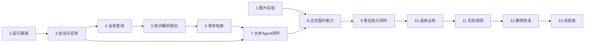

# Development Plan — GlobalMail Agent

版本：v1.0；进度更新：2026-10-08。状态：Phase 1本轮探索结束，保留未通过项；Phase 2运行基础已实现；Phase 3四步技术验证及最终独立两阶段审查通过，待用户查看；Phase 4–13未开始。

本文件记录开发顺序、交付物、关键文件与验收归属。它不改变业务范围，不将已有数据、组件实验或设计审查折算为正式应用完成。Phase 1 结果见 [图片实验报告](docs/verification/VISUAL-VALIDATION.md)：35场景108次真实请求，仍有关键业务失败，标签人工核对待完成。

## 1. 输入基线与实施规则

- 产品依据：[Product-Spec v1.13](Product-Spec.md)，包括全部14项REQ、20项P0 SCOPE、82项AC及17项DEMO。
- 运行契约：[AGENT-ARCHITECTURE v1.1](AGENT-ARCHITECTURE.md)；专题见 [技术选型](docs/architecture/TECH-SELECTION.md)、[知识设计](docs/architecture/KNOWLEDGE-DESIGN.md)。主架构决定状态、权限、事务和发布行为，计划只分配实现工作。
- 场景依据：[业务场景](docs/business/BUSINESS-SCENARIOS.md)、[验收映射及18类故障时序](docs/verification/AGENT-ACCEPTANCE.md)、[数据契约](data/knowledge/v1/DATA-CONTRACT.md)。本轮对齐记录见 [文档一致性检查](docs/verification/DOCUMENT-CONSISTENCY-REVIEW.md)。
- 已有：三品牌/8产品族/34 SKU、22份逻辑知识、51个环节输入和21条连续流程；前端副本、tech-spike与knowledge-spike已有证据。客户图片专项已实施且验收未通过；已有Phase 2后端与前端运行基础；应用知识索引和业务闭环尚未实现。
- UI依据：已复制的 Art Design Pro，来源与哈希见 [前端基线](globalmail-agent/frontend/FRONTEND-BASELINE.md)。没有独立 Design-Brief/设计稿，按已确认的ASM-008继承现成组件和主题，不新增视觉设计阶段、不重搭前端。
- 本期只交付单用户、本机隔离运行；七类业务、图片三项能力、长期知识维护均为首版。真实邮箱/生产ERP/真实退款与履约、客户PDF/视频/音频、多租户及HA不在本计划内。P1的扩型号、扩语言和手机端精细适配不挤入首版门槛。
- 每阶段完成一个可启动并可检查的功能单元；界面随其服务交付。尚未实现的动作不得显示成功、返回编造结果或用预填参考回复冒充Agent。中间阶段的局部闭环不能宣称七类业务已交付。

## 2. 阶段总览与依赖

| Phase | 可观察交付 | 前置 | 状态 |
|---|---|---|---|
| 1 | 冻结客户图片样本并运行真实图文能力实验 | 当前资料及模型配置 | 本轮探索结束；原业务失败及人工核对项保留 |
| 2 | 启动本机API、持久数据库和Art Design Pro业务外壳 | 1；纯工程准备可独立推进 | 四步技术验证通过，待用户查看 |
| 3 | 导入/创建会话、逐封回放、人审和持久任务可操作 | 2 | 四步技术验证通过，待用户查看；[实测记录](docs/verification/PHASE-3-VALIDATION.md) |
| 4 | 查询准确订单、商品、库存、物流与政策条件 | 3 | 未开始 |
| 5 | 上传/修订知识、解析并人工核对 | 2、4的商品范围 | 未开始 |
| 6 | 构建向量、发布/回滚、检索试查及下架 | 5 | 未开始 |
| 7 | 在工作台完成文本Agent查单、检索、回复与人审闭环 | 3、4、6 | 未开始 |
| 8 | 在正式工作台接收图片、核验字段并分流 | 1、7 | 未开始 |
| 9 | 提交售后申请、模拟人工执行并查询回执 | 4、6、7；图片动作依赖8 | 未开始 |
| 10 | 连续跟进、异步事件、多订单与方案变更 | 9 | 未开始 |
| 11 | 查看实际Langfuse追踪并验证观测降级 | 7、8、10 | 未开始 |
| 12 | 重置/删除、联合备份恢复及防止旧数据复活 | 3、6、8、10、11 | 未开始 |
| 13 | 七类业务、图片和故障回归通过，交付本地运行说明 | 1–12 | 未开始 |

默认按编号推进。Phase 1若发现模型质量或预算适配不足，先保存失败并在原模型/预算内修正，不自动换模型、增OCR供应商或减掉图片范围；影响既定需求时先同步源文档。它不阻止独立的Phase 2工程准备，但未达标不能关闭Phase 8/13。

## Phase 1: 客户图片样本与图文风险实验

**交付内容**：
- 制作并冻结VIS-001至VIS-018的输入清单、实际受控图片及隔离标签；覆盖三品牌、清晰/模糊、反光/正常/异常、图文冲突、危险、仅图片/CID、多图及故障参数。18个编号不等于18张图片，每项按场景文档列出分支。
- 运行真实Qwen图文联合Schema请求，验证字段、观察、分流候选和用量；进行受限全图/裁剪对照，无图路径不新增视觉请求，不加载未来事件或参考答案。
- 输出逐样本结果、错误分组、耗时/usage及预处理配置，确认原6模型/12工具/120秒、16k/2k/80k预算的可用输入范围；只有元数据的样本专门验证未读取路径。

**关键文件（新增）**：
- `data/visual/v1/manifest.jsonl`、`data/visual/v1/README.md` — 图片摘要、来源/许可、消息/商品关系及分支清单；获准输入字节置于本目录的`images/`。
- `data/visual/v1/evaluation/labels.jsonl` — 人工复核字段、观察边界、允许分流与禁止动作，与模型加载路径隔离。
- `globalmail-agent/vision-spike/build_fixtures.py`、`globalmail-agent/vision-spike/probe_vision.py`、`globalmail-agent/vision-spike/validate_fixtures.py`、`globalmail-agent/vision-spike/README.md` — 样本冻结、运行及可复跑入口；使用tech-spike锁定模型环境，结果绑定输入摘要。
- `docs/verification/VISUAL-VALIDATION.md` — 专项结果、失败及进入正式实现的约束。

**验收标准**：脚本可运行并生成新报告；AI行为样本至少连续3次真实请求，分别核对精确字段/歧义、观察误报漏报、分流依据和禁止动作。跨客户泄漏、编造交易成功、危险通电指导任一出现均失败，不能用平均分抵消。标签经人工核对并与输入隔离；运行时并发/删除/UI类VIS先冻结输入，留给Phase 8/12/13验证，不在实验报告假称已通过。无无法解释的关键失败才能进入正式图片能力验收。

2026-10-07用户决定：停止重复合成图探索，提交现有证据并进入Phase 2。字段提取54/54匹配仅限本集；不把业务分流错误算成OCR失败，也不改写原始失败/人工pending。正式图片能力仍在Phase 8/13结合完整上下文验证。

## Phase 2: 本机运行基础与前端外壳

**交付内容**：
- 建立FastAPI正式工程、Alembic迁移和独立PostgreSQL持久卷，配置安全运行状态接口、参数校验及统一错误返回；密钥只读服务端环境。
- 用既有前端锁文件安装和构建，复用后台外壳及主题，配置本地单用户入口、工作台/知识导航，移除对模板演示登录/用户接口的运行依赖。
- 建立受控对象存储、内容依赖登记和删除journal基础表；从首个正文对象起登记来源及作用域，后续模块复用，避免到删除阶段才补追踪。

**关键文件**：
- 新增`globalmail-agent/backend/pyproject.toml`、`globalmail-agent/backend/uv.lock`、`globalmail-agent/backend/src/globalmail_agent/main.py`、`globalmail-agent/backend/src/globalmail_agent/settings.py` — 正式依赖与应用入口。
- 新增`globalmail-agent/backend/src/globalmail_agent/api/system.py`、`globalmail-agent/backend/src/globalmail_agent/adapters/database.py`、`globalmail-agent/backend/src/globalmail_agent/adapters/object_store.py`、`globalmail-agent/backend/src/globalmail_agent/application/content_dependencies.py` — 健康状态、事务、对象和依赖基础。
- 新增`globalmail-agent/backend/migrations/versions/0001_runtime_foundation.py`、`globalmail-agent/infra/compose.yaml`、`globalmail-agent/scripts/start-local.ps1` — 基础迁移、本项目隔离数据库和启动入口。
- 修改`globalmail-agent/frontend/src/router/modules/index.ts`、`globalmail-agent/frontend/src/router/guards/beforeEach.ts`、`globalmail-agent/frontend/src/utils/http/index.ts`；新增`globalmail-agent/frontend/src/router/modules/mail-agent.ts`、`globalmail-agent/frontend/src/views/mail-agent/index.vue`、`globalmail-agent/frontend/src/views/knowledge/index.vue` — 接入现有路由/请求方式，未接功能显示真实空状态。

**验收标准**：前端构建、后端导入检查和迁移均通过；启动后页面可访问并显示API/数据库实际状态，重启后持久数据保留。默认仅127.0.0.1，非法Host/Origin拒绝，浏览器响应无Key/连接串。端口冲突明确报错；不修改其他项目容器/数据或Art Design Pro源目录，不安装或升级整套前端替代锁文件。

Phase 2结果：[验证记录](docs/verification/PHASE-2-VALIDATION.md)、[独立两阶段审查](docs/verification/PHASE-2-REVIEW-FINAL.md)。12后端测试、4前端测试、3脚本测试通过，构建/真实PG重启持久/HTTP安全/浏览器故障恢复通过；业务能力留后续阶段。

## Phase 3: 会话、历史回放、人审与持久任务

**交付内容**：
- 实现受控导入、身份归组、手动来信、历史游标和当前前缀查询；真实跨源身份未经复核时仅独立案例回放，group_id不作身份。
- 实现处理权、输入版本、稳定CaseIssue与有来源的案件事实、人审草稿/回复、人工结案与重开，形成唯一触发和Agent任务；未接正式模型时仅验证任务协议，不写假自动回复。
- 实现Agent单槽、知识独立槽、租约/fence、停止/中断/显式重试、事件日志和SSE补读；页面可操作会话与人工流程，刷新不会排任务。

**关键文件（新增）**：
- `globalmail-agent/backend/src/globalmail_agent/domain/conversation.py`、`globalmail-agent/backend/src/globalmail_agent/domain/case.py`、`globalmail-agent/backend/src/globalmail_agent/adapters/import_loader.py`、`globalmail-agent/backend/src/globalmail_agent/application/conversations.py`、`globalmail-agent/backend/src/globalmail_agent/application/replay.py`、`globalmail-agent/backend/src/globalmail_agent/application/human_review.py` — 输入、稳定事项与事实、历史隔离及人审用例。
- `globalmail-agent/backend/src/globalmail_agent/worker/jobs.py`、`globalmail-agent/backend/src/globalmail_agent/worker/leases.py`、`globalmail-agent/backend/src/globalmail_agent/application/event_store.py`、`globalmail-agent/backend/src/globalmail_agent/api/conversations.py`、`globalmail-agent/backend/src/globalmail_agent/api/events.py` — 持久任务及API/SSE。
- `globalmail-agent/backend/migrations/versions/0002_conversations_jobs.py` — 身份/消息、处理权、cycle/run/task、事件和人审表。
- `globalmail-agent/frontend/src/components/mail-agent/ConversationList.vue`、`globalmail-agent/frontend/src/components/mail-agent/MessageTimeline.vue`、`globalmail-agent/frontend/src/components/mail-agent/HumanReviewPanel.vue`、`globalmail-agent/frontend/src/composables/useConversationEvents.ts`、`globalmail-agent/frontend/src/api/mail-agent.ts` — 三栏基础交互和事件订阅。

**验收标准**：页面可创建/导入、追加来信、推进历史、接管/人工回复和结案；不同身份不合并，未来消息与AI对照不进入真实前缀。人审后业务事件只记账，下一封新来信才获得自动处理资格；过期人工表单409。真实PG检验重复消息、租约失效、SSE重连与中断后的显式重试；模型执行在Phase 7接入后重验自动恢复。准备FT-01/02/05/07/08的时序控制接口，不靠随机sleep碰竞态。

## Phase 4: 业务数据、精确查询与政策条件

**交付内容**：
- 从允许清单装载商品、订单快照、模拟分支、配件适配、库存与现有物流/操作，来源快照不可变；未来事件、完整故事、评测答案不进入运行上下文。
- 实现受身份/模式/截点约束的订单、包裹、可用库存及既有操作查询，区分无记录、当时不可用、未知及技术失败。
- 实现版本化政策解释器与资格计算，使用最小货币单位整数、数量/客户选择/地址版本及证据kind检查；在工作台业务详情中可看事实和缺失条件。

**关键文件（新增）**：
- `globalmail-agent/backend/src/globalmail_agent/adapters/fixture_loader.py`、`globalmail-agent/backend/src/globalmail_agent/domain/orders.py`、`globalmail-agent/backend/src/globalmail_agent/domain/inventory.py`、`globalmail-agent/backend/src/globalmail_agent/domain/policy.py` — 白名单加载、精确关系和规则。
- `globalmail-agent/backend/src/globalmail_agent/application/business_queries.py`、`globalmail-agent/backend/src/globalmail_agent/application/eligibility.py`、`globalmail-agent/backend/src/globalmail_agent/api/business.py` — 查询与资格服务，不提供Agent推进状态接口。
- `globalmail-agent/backend/migrations/versions/0003_business_catalog.py` — 商品、订单行、库存/兼容、模拟分支、政策及已有操作/执行/包裹/退件的同一份账本结构；先提供受控查询，Phase 9增加业务写入和占用事务。
- `globalmail-agent/frontend/src/components/mail-agent/BusinessDetails.vue` — 按订单行/包裹展示事实、来源和缺口。
- `data/knowledge/v2/authoring/policy-profile.json`、`data/knowledge/v2/policies/policy-profile.json`、`data/knowledge/v2/policies/policy-profile.md`、`data/knowledge/v2/README.md`、`data/knowledge/v2/build_policy.py`、`data/knowledge/v2/policy-bundle.json` — 增补图片资格所需evidence_requirements的独立政策修订、生成器及清单（规则/说明摘要、适用范围、effective_at、supersedes和v1引用）；不覆盖v1或改动已确认数值，不把v2当完整重制知识包。原fixture继续绑定v1；图片专项明确选择经核对的v2。

**验收标准**：真实API能查询准备数据且不能跨客户/品牌/分支；多商品无目标时返回澄清要求；历史无合法快照保持不可用。政策规则与自动生成说明一致，缺证据类型返回needs_input/requires_review，不默认将视觉观察当账本事实。新规则经核对后在Phase 6同版发布；未发布政策不得供Agent授权。此阶段不声称已经办理退款或补发。

## Phase 5: 知识原件、解析核对与维护页面

**交付内容**：
- 实现资料列表、上传、Markdown修订/PDF替换、政策编辑与生成说明、精确章节适用绑定及不可变版本；保存不发布。
- 实现独立知识worker与MinerU进程，保留规范块、表头/单位/警告、页码/图号及诊断；17页物理PDF只解析一次，再投影8份逻辑资料。
- 提供原件/解析对照、核对、版本差异、失败重试/取消及任务状态；关键缺失阻止对应内容通过核对。

**关键文件（新增）**：
- `globalmail-agent/backend/src/globalmail_agent/knowledge/documents.py`、`globalmail-agent/backend/src/globalmail_agent/knowledge/parser_contract.py`、`globalmail-agent/backend/src/globalmail_agent/knowledge/review.py`、`globalmail-agent/backend/src/globalmail_agent/knowledge/policy_bundle.py` — 原件、规范内容和同源政策。
- `globalmail-agent/backend/src/globalmail_agent/worker/knowledge_runner.py`、`globalmail-agent/backend/src/globalmail_agent/api/knowledge_documents.py` — 独立任务与维护入口。
- `globalmail-agent/parser-worker/pyproject.toml`、`globalmail-agent/parser-worker/uv.lock`、`globalmail-agent/parser-worker/parse_document.py` — MinerU 4.0.10独立环境；根据已有requirements锁重建兼容依赖，不合入主SDK环境。
- `globalmail-agent/backend/migrations/versions/0004_knowledge_content.py` — 文档/版本、适用关系、规范块、核对及知识审计。
- `globalmail-agent/frontend/src/components/knowledge/DocumentEditor.vue`、`globalmail-agent/frontend/src/components/knowledge/ParseReview.vue`、`globalmail-agent/frontend/src/components/knowledge/VersionTasks.vue`；修改`globalmail-agent/frontend/src/views/knowledge/index.vue` — 复用表单/抽屉。

**验收标准**：页面上传→解析→原件对照→核对可完成，失败显示真实阶段，修改正文/解析/范围使旧核对失效。PDF关键条件、单位、SKU/页图范围逐项核验，不用编辑源代替解析；超过50MiB/300页拒绝，解析超过15分钟终止本任务进程树。知识任务不占Agent槽位；原件按依赖登记，未发布内容不可被Agent检索。

## Phase 6: 向量构建、发布检索与下架

**交付内容**：
- 实现短文保完整、长文结构切块、父文档去重补全及实际输入摘要缓存，真实调用qwen3.7-text-embedding 1024维；索引构建与内容版本分别管理。
- 实现完整manifest校验、显式发布/回滚、政策同版与独立模型空间；失败保旧版，发布CAS、下架fence及晚到任务门禁生效。
- 接通检索试查与引用预览，服务端先精确过滤再排序；页面无需SQL即可完成上传至发布/下架的维护闭环。

**关键文件（新增）**：
- `globalmail-agent/backend/src/globalmail_agent/knowledge/chunking.py`、`globalmail-agent/backend/src/globalmail_agent/knowledge/embedding.py`、`globalmail-agent/backend/src/globalmail_agent/knowledge/builds.py`、`globalmail-agent/backend/src/globalmail_agent/knowledge/releases.py`、`globalmail-agent/backend/src/globalmail_agent/knowledge/retrieval.py`、`globalmail-agent/backend/src/globalmail_agent/knowledge/references.py` — 构建、发布头、当前资格检查与证据。
- `globalmail-agent/backend/src/globalmail_agent/api/knowledge_releases.py`、`globalmail-agent/backend/src/globalmail_agent/api/knowledge_search.py` — 发布/回滚/试查。
- `globalmail-agent/backend/migrations/versions/0005_knowledge_index.py` — profile/build/向量、release/head、政策捆绑及引用。
- `globalmail-agent/frontend/src/components/knowledge/ReleaseActions.vue`、`globalmail-agent/frontend/src/components/knowledge/SearchPreview.vue` — 发布差异、下架确认及命中来源。

**验收标准**：真实模型向量进入本项目正式PG；草稿/失败/撤销/错误SKU/模式/时间均不命中，政策说明与规则同版。检索最多20候选、5份证据及约4500知识上下文，补父块再核对范围/摘要。60条开发查询重跑并另建未调参查询，正例关键证据Recall@5项目目标≥90%、越界命中0，不能用候选少的top5成绩宣称生产精度。FT-09/10的发布、下架、同维换模型与失败保旧通过；运行中回复的提交竞争在Phase 7接入后补验。彻底删除在Phase 12开放，此阶段只提供准确的下架状态。

## Phase 7: 文本Agent与首个工作台闭环

**交付内容**：
- 实现可信RunContext、可见历史/案件记忆、结构化多诉求理解和LangGraph动态工具循环；接通已完成的查询/知识工具，候选事实可由工具和人工更正。
- 实现统一预算、工具网关、风险直接人审、最终提交、正常等待及检查点写栅栏；每cycle最多一个终局/自动出站，不直接resume旧HITL动作。
- 在工作台真实跑通“缺订单→补充订单→查适用资料→有依据回复→失败反馈→新依据或人审→人工回复后新来信恢复”，显示工具、引用、状态及本地用量。

**关键文件（新增）**：
- `globalmail-agent/backend/src/globalmail_agent/agent/context.py`、`globalmail-agent/backend/src/globalmail_agent/agent/understanding.py`、`globalmail-agent/backend/src/globalmail_agent/agent/graph.py`、`globalmail-agent/backend/src/globalmail_agent/agent/tool_gateway.py`、`globalmail-agent/backend/src/globalmail_agent/agent/budget.py`、`globalmail-agent/backend/src/globalmail_agent/agent/prompts/understanding.md`、`globalmail-agent/backend/src/globalmail_agent/agent/prompts/decision.md` — 提示词代码版本化，模型适配沿用既有探针。
- `globalmail-agent/backend/src/globalmail_agent/application/commit_outcome.py`、`globalmail-agent/backend/src/globalmail_agent/application/risk_handoff.py`、`globalmail-agent/backend/src/globalmail_agent/application/waits.py`、`globalmail-agent/backend/src/globalmail_agent/adapters/checkpoint_repository.py`、`globalmail-agent/backend/src/globalmail_agent/worker/agent_runner.py` — 同事务终局、必要等待/wake_pending、确定性危险接管与检查点保护；Phase 10扩展业务事件，不延后基础防漏唤醒规则。
- `globalmail-agent/backend/src/globalmail_agent/observability/local_records.py`、`globalmail-agent/backend/src/globalmail_agent/observability/usage.py`、`globalmail-agent/backend/src/globalmail_agent/observability/sanitization.py` — 从第一轮正式调用开始记录去重usage及安全摘要，不等Phase 11才考虑隐私。
- `globalmail-agent/backend/migrations/versions/0006_agent_results.py` — 理解、工具凭证、回复、等待/wake_pending、用量/trace关联和检查点；扩展Phase 3已有案件事实/修订，不重复建表。
- `globalmail-agent/frontend/src/components/mail-agent/MessageComposer.vue`、`globalmail-agent/frontend/src/components/mail-agent/AgentRunPanel.vue`、`globalmail-agent/frontend/src/components/mail-agent/ReferenceDrawer.vue`；修改`globalmail-agent/frontend/src/views/mail-agent/index.vue` — 自动模拟回复、停止重试和证据展示，路径均在frontend。

**验收标准**：使用真实Qwen完成至少3封客户来信及HITL恢复，英/德回复、条件退款不误执行、多诉求/多商品澄清正确；无适用步骤不编造。真实PG验证FT-01/02/04/05/08/09/10：提交与撤销共锁、未知结果查凭证、checkpoint的put/pending-writes与校验同事务；如锁定SDK不能直接实现则在适配器内修正并实测，不降级成检查后另连写入。停止/预算耗尽无半成品出站，显式重试沿用cycle剩余额度。SSE恢复、主题切换及1280×720/1440×900可用。售后写能力尚未交付，阶段验收不冒充七类业务完整通过。

## Phase 8: 正式图片输入、证据与人工更正

**交付内容**：
- 实现暂存上传、实际格式/像素核验、附件/CID绑定、仅图来信、授权原图/缩略图预览及逐图状态；重发以新客户来信入库。
- 将Phase 1验证的图文Understanding接入正式Agent，候选字段经业务工具精确核验；观察/推测/客户陈述/工具事实分层，风险与HumanReview同事务提交。
- 提供图片证据抽屉、人工更正、证据撤销与依赖追踪；图文成本共用原预算，图片不入共享知识库，原图/base64不入checkpoint/观测。

**关键文件（新增）**：
- `globalmail-agent/backend/src/globalmail_agent/attachments/intake.py`、`globalmail-agent/backend/src/globalmail_agent/attachments/views.py`、`globalmail-agent/backend/src/globalmail_agent/attachments/evidence.py`、`globalmail-agent/backend/src/globalmail_agent/attachments/corrections.py`、`globalmail-agent/backend/src/globalmail_agent/attachments/revocation.py` — 受控图像、来源/修订和即时撤销。
- `globalmail-agent/backend/src/globalmail_agent/api/attachments.py`、`globalmail-agent/backend/src/globalmail_agent/api/visual_evidence.py`；修改`globalmail-agent/backend/src/globalmail_agent/agent/understanding.py`、`globalmail-agent/backend/src/globalmail_agent/application/risk_handoff.py` — API与正式联合理解。
- `globalmail-agent/backend/migrations/versions/0007_visual_evidence.py` — staging/attachment/revision、分析/视觉证据及更正。
- `globalmail-agent/frontend/src/components/mail-agent/ImageUpload.vue`、`globalmail-agent/frontend/src/components/mail-agent/ImageEvidenceDrawer.vue`；修改`globalmail-agent/frontend/src/components/mail-agent/MessageComposer.vue`、`globalmail-agent/frontend/src/components/mail-agent/MessageTimeline.vue` — 上传、逐图覆盖和更正，组件路径均在mail-agent目录。

**验收标准**：真实图片输入完成VIS字段、正常/反光/异常及危险分流；0/O歧义不猜号、图片正常不否定功能故障，截图不覆盖业务回执。4图/10MiB/20MiB/20百万像素/6视图限制明确；技术失败不说成模糊。FT-13/14/16/17/18通过，旧响应/缓存不覆盖人工更正或越过HITL。危险事务不等待额外模型，仍服从停止/过期/删除栅栏。正式售后申请路径随Phase 9补验；删除完成状态须等Phase 12端到端清理验证，撤销后立即禁用证据。

## Phase 9: 内部售后申请与模拟人工执行

**交付内容**：
- 实现退款、退货、换货、补件及查件的内部申请/取消/对账，复核政策、客户选择、精确数量金额及已有补偿；跨run/issue检查互斥，未知结果保留原操作及占用。
- 实现独立模拟执行记录、库存占用、退货资料/收件质检、支付回执及物流状态；场景控制台可按有效申请推进，无法匹配申请时拒绝造结果。
- 将写工具接入Agent，支持符合条件时自动提交内部待办、查询执行记录并如实回复；模拟执行控制器不注册为模型工具。

**关键文件（新增）**：
- `globalmail-agent/backend/src/globalmail_agent/domain/operations.py`、`globalmail-agent/backend/src/globalmail_agent/domain/compensation.py`、`globalmail-agent/backend/src/globalmail_agent/domain/executions.py`、`globalmail-agent/backend/src/globalmail_agent/domain/returns.py` — 状态机、金额数量占用和回执条件。
- `globalmail-agent/backend/src/globalmail_agent/application/after_sales.py`、`globalmail-agent/backend/src/globalmail_agent/application/reconciliation.py`、`globalmail-agent/backend/src/globalmail_agent/application/simulation_control.py`、`globalmail-agent/backend/src/globalmail_agent/api/simulation.py` — 事务入口与独立控制端。
- `globalmail-agent/backend/src/globalmail_agent/agent/tools/after_sales.py`；修改`globalmail-agent/backend/src/globalmail_agent/agent/tool_gateway.py` — 内部申请/取消/查询，不允许制造履约事实。
- `globalmail-agent/backend/migrations/versions/0008_after_sales_ledger.py` — 在Phase 4同一账本上增加补偿/库存预留及写命令约束，关联既有operation/execution/包裹/退件和政策decision，不另建查询影子账本。
- `globalmail-agent/frontend/src/components/mail-agent/OperationDetails.vue`、`globalmail-agent/frontend/src/components/mail-agent/ScenarioControl.vue` — 内部申请、执行单、回执和手工关联备用入口。

**验收标准**：七类中的交易主路径可由“实际Agent申请→人工控制台执行→Agent查结果”运行；金额/币种、数量/规格、地址版本与收件前提成立。重复请求/新键、响应丢失、unknown、缺货、失败/取消均不重复赔付；内部预留与实际模拟库存占用不双算。FT-03/04/05/06通过。图片相关资格按evidence_requirements核验，补齐VIS-005/007；不把申请受理、运单创建或客服承诺写为退款/发货成功。

## Phase 10: 异步跟进、连续流程与方案转换

**交付内容**：
- 扩展已有CaseIssue、WaitCondition、wake_pending与版本化业务事件处理，覆盖结果先于/后于等待注册、重复/乱序/无关事件；正常等待无新事实不持续调用模型。
- 实现同一客户多订单待办、客户改方案、取消/不能取消/结果未知、补件后物流及退货后退款；人工执行业务与HITL接管保持独立。
- 建立连续流程驱动器与运行报告，按实际Agent输出和业务账本满足gate后交付下一事件，工作台可查看事项与等待条件。

**关键文件（新增）**：
- `globalmail-agent/backend/src/globalmail_agent/application/waits.py`（修改）、`globalmail-agent/backend/src/globalmail_agent/application/business_events.py`、`globalmail-agent/backend/src/globalmail_agent/application/plan_changes.py`、`globalmail-agent/backend/src/globalmail_agent/worker/event_dispatcher.py` — 扩展已有等待，完成事件唤起、方案核查和去重。
- `globalmail-agent/backend/migrations/versions/0009_business_waits.py` — 扩展已有事项、等待、wake_pending的业务事件关联/消费索引；不重建Phase 3/7已交付的基础表。
- `globalmail-agent/backend/src/globalmail_agent/evaluation/journey_driver.py`、`globalmail-agent/backend/src/globalmail_agent/evaluation/scenario_driver.py`、`globalmail-agent/backend/src/globalmail_agent/evaluation/reporting.py` — 驱动与答案读取权限独立于Agent加载器。
- `globalmail-agent/frontend/src/components/mail-agent/CaseIssues.vue`；修改`globalmail-agent/frontend/src/components/mail-agent/ScenarioControl.vue`、`globalmail-agent/frontend/src/components/mail-agent/OperationDetails.vue` — 多事项等待及可追溯事件。

**验收标准**：21条JRN逐条实际运行并到人工结案，原51环节输入回归，SCN并列变体补足。FT-02/03/06/07验证不漏唤醒、排队不等于消费、重复事件不重复出站；人审/人工回复后等待客户的事件只记录。运行中断仍需显式重试，不被业务事件绕过门禁。客服参考回复只供评分，禁止写入实际会话替代Agent输出；客户反馈必须由驱动按gate提供。

## Phase 11: 自托管Langfuse与实际观测验收

**交付内容**：
- 按官方自托管组合建立独立observability配置，使用独立库/凭据/卷；部署验证后固定完整镜像digest清单，SDK版本不冒充服务版本。
- 将正式理解/视觉/模型/检索/工具/规则/提交关联到同一run，界面展示trace链接及观测故障，usage沿用唯一计量路径。
- 验证导出前字段过滤、媒体禁出站、有界队列、网络超时/服务失败与受限flush，业务提交不依赖Langfuse在线。

**关键文件（新增）**：
- `globalmail-agent/infra/compose.observability.yaml`、`globalmail-agent/infra/observability-images.lock.json` — 按核验官方版本生成完整自托管清单；禁用浮动latest作为交付锁。
- `globalmail-agent/backend/src/globalmail_agent/observability/tracing.py`、`globalmail-agent/backend/src/globalmail_agent/observability/exporter.py`、`globalmail-agent/backend/src/globalmail_agent/observability/media_filter.py`；修改`globalmail-agent/backend/src/globalmail_agent/observability/sanitization.py`、`globalmail-agent/backend/src/globalmail_agent/observability/local_records.py` — 受控callback/span、媒体预处理和导出门禁。
- `globalmail-agent/backend/src/globalmail_agent/api/observability.py`；修改`globalmail-agent/frontend/src/components/mail-agent/AgentRunPanel.vue` — 实际关联与降级状态。

**验收标准**：自托管UI中可打开实际多工具及图文run，跨异步关联正确、不双计usage；测试正常/异常payload、媒体处理、队列和HTTP网络失败，敏感标记及图像字节/可访问链接均不出站。不能只依赖晚于SDK媒体处理的导出mask去拦图片，须在callback/媒体处理前阻断；FT-12通过，观测断开业务仍运行。登记本地trace及缓冲依赖，为Phase 12实际清理提供入口，不使用Langfuse Cloud替代。

## Phase 12: 完整删除、重置与联合恢复

**交付内容**：
- 实现会话/模拟分支重置、资料/客户图片彻底删除：先撤销和停写，再清理、验证；页面展示影响、清理中、失败及完成，不误删外部源包或其他分支。
- 清理所有已暴露给模型的正文依赖，包括原件、解析/图像派生、向量/缓存、工具结果、摘要、checkpoint/pending-writes、草稿/模拟回复及本地Langfuse内容；已发生业务保留无正文防重账本。
- 实现数据库+对象+配置联合备份、独立最新删除journal和封闭恢复；先应用撤销/删除水位，再重建合法索引并开放读取。

**关键文件（新增）**：
- `globalmail-agent/backend/src/globalmail_agent/application/lifecycle.py`、`globalmail-agent/backend/src/globalmail_agent/application/deletion.py`、`globalmail-agent/backend/src/globalmail_agent/application/restore.py`、`globalmail-agent/backend/src/globalmail_agent/worker/cleanup_runner.py`、`globalmail-agent/backend/src/globalmail_agent/observability/purge.py` — 删除编排、依赖枚举、导出停写与恢复门禁。
- `globalmail-agent/backend/src/globalmail_agent/api/lifecycle.py`、`globalmail-agent/backend/src/globalmail_agent/adapters/deletion_journal.py`、`globalmail-agent/backend/src/globalmail_agent/adapters/backup_store.py` — 影响预览、持久journal及备份。
- `globalmail-agent/backend/migrations/versions/0010_lifecycle_verification.py`、`globalmail-agent/scripts/backup-local.ps1`、`globalmail-agent/scripts/restore-local.ps1` — 清理验证状态与封闭恢复入口，两个脚本均在scripts目录。
- `globalmail-agent/frontend/src/components/shared/DeletionDialog.vue`、`globalmail-agent/frontend/src/components/shared/DeletionStatus.vue` — 分开下架/撤销和彻底删除，取消确认不改变数据。

**验收标准**：真实PG、对象目录、checkpoint和已部署观测服务联合执行FT-11/15，晚到响应/检查点/SDK缓冲不能复活正文；清理失败保持失败且可重试。共享PDF不能安全分离则blocked_dependencies，不伪称完成；旧备份缺最新删除水位不开放。验证源包摘要、其他分支和已发生操作去重均不变；明确外部文件/供应商/离线备份不属于本地完成承诺。

## Phase 13: 全量业务验收与本地交付

**交付内容**：
- 串行执行82项AC、17项DEMO、30项SCN、21条JRN、18项VIS及18类FT；AI行为开发样本至少连续重跑3次，保留每次失败及真实请求、版本、账本和用量。
- 验证Art Design Pro两页及13项控件的操作、空/加载/错误/受限/成功状态、明暗主题、键盘及两档桌面分辨率；本地启动无模板演示后端依赖。
- 输出本地安装/启动/停机/重试/知识维护/场景演练/备份恢复说明和验收报告；审查代码与文档一致，形成明确的已完成范围与剩余限制。

**关键文件（新增）**：
- `globalmail-agent/backend/src/globalmail_agent/evaluation/suite.py`、`globalmail-agent/backend/src/globalmail_agent/evaluation/metrics.py`、`globalmail-agent/backend/src/globalmail_agent/evaluation/holdout_gate.py` — 汇总确定性断言、人工评分和隔离门；LLM judge只能辅助。
- `globalmail-agent/scripts/verify-local.ps1`、`globalmail-agent/README.md` — 可复跑校验和完整本地操作说明。
- `docs/verification/ACCEPTANCE-RESULTS.md` — 每条AC和场景的证据索引、失败及修复复跑。
- `docs/planning/SESSION-HANDOFF.md`、`DEV-PLAN.md` — 按当场证据回写完成情况和下一步。

**验收标准**：全部P0实现且相关四步验证通过后才勾选AC；任何越权、未来泄漏、错误型号指导、重复赔付、危险操作或虚构履约成功均不能带过。10个eval_holdout先复核隐私、稳定身份/近重复隔离和合理动作标签，未获准/未标注则明确不运行、不报独立准确率；允许如实交付开发验收，不把它改名为独立测试。当前simulation知识不能注入真实历史，缺合法历史资料返回不可用。独立评测准备状态写入结果，不据此伪造生产收益。

## 3. 需求、界面和验收归属

下表是实施责任，不是通过记录。上游阶段完成模块后，下游真实模型/集成/UI检查仍须执行；仅满足AC全条件并留证据才更新Spec的复选框，Phase 13统一复核。

| 源需求 | 实施阶段 | 必须交付的范围 |
|---|---|---|
| REQ-001 | 3、4 | 导入去重、可信身份、客户/订单隔离 |
| REQ-002 | 3、7 | 历史前缀、统一截点、对照结果隔离 |
| REQ-003 | 3、7 | 手动来信、自动模拟出站、cycle唯一终局 |
| REQ-004 | 4、7、8 | 订单复用、商品定位、图片字段精确核验 |
| REQ-005 | 5、6、7、12 | 原件、解析、维护、检索、同版发布及完整删除 |
| REQ-006 | 7、10 | 动态决策、案件记忆、多事项与等待 |
| REQ-007 | 3、7、8、10 | HITL、危险接管、新来信恢复、人工结案 |
| REQ-008 | 3、7、10、12 | 任务/预算、停止重试、事务/检查点/删除栅栏 |
| REQ-009 | 2、3、7、8、9、10、11 | 三栏工作台、引用、人审及业务状态 |
| REQ-010 | 3、12、13 | 数据管理、重置清理、评测隔离 |
| REQ-011 | 4、9、10 | 七类业务、内部申请、独立模拟执行与连续跟进 |
| REQ-012 | 7、8、10 | 多诉求、条件/选择、修正及格式失败 |
| REQ-013 | 7、11、12 | 本地记录、实际Langfuse、媒体/隐私过滤和清理 |
| REQ-014 | 1、8、9、12、13 | 图片文字、可见异常、业务分流、生命周期及专项实测 |

**P0范围归属**（SCOPE-011为P1，不计入本表）：

| 范围 | 实施阶段 |
|---|---|
| SCOPE-001 | 3、7 |
| SCOPE-002 | 3、7 |
| SCOPE-003 | 4、7、8 |
| SCOPE-004 | 5、6、7 |
| SCOPE-005 | 3、7、10 |
| SCOPE-006 | 7、8、9 |
| SCOPE-007 | 3、7、8、10 |
| SCOPE-008 | 2、3、7、8、11 |
| SCOPE-009 | 2、6、12 |
| SCOPE-010 | 1、7、11、13 |
| SCOPE-012 | 4、9、10 |
| SCOPE-013 | 4、9、10 |
| SCOPE-014 | 4、9、10 |
| SCOPE-015 | 9、10 |
| SCOPE-016 | 7、8、10 |
| SCOPE-017 | 7、11、12 |
| SCOPE-018 | 5、6、12 |
| SCOPE-019 | 1、8 |
| SCOPE-020 | 1、8 |
| SCOPE-021 | 1、8、9 |

**82项AC的唯一主交付归属**（完整断言仍以Spec及验收映射为准）：

| Phase | 主负责AC |
|---|---|
| 3 | AC-001、AC-002、AC-003、AC-004、AC-005、AC-006、AC-021、AC-023、AC-027 |
| 4 | AC-012 |
| 5 | AC-055、AC-063 |
| 6 | AC-013、AC-014、AC-016、AC-030、AC-056、AC-057、AC-058、AC-059、AC-061、AC-062、AC-064 |
| 7 | AC-007、AC-008、AC-009、AC-010、AC-011、AC-015、AC-017、AC-018、AC-019、AC-020、AC-022、AC-024、AC-025、AC-026、AC-028、AC-032、AC-044、AC-045、AC-046、AC-047、AC-048、AC-052 |
| 8 | AC-065、AC-066、AC-067、AC-068、AC-069、AC-070、AC-071、AC-072、AC-073、AC-074、AC-075、AC-076、AC-077、AC-079、AC-080、AC-081 |
| 9 | AC-034、AC-035、AC-036、AC-037、AC-038、AC-039、AC-040、AC-054 |
| 10 | AC-033、AC-041、AC-042、AC-043、AC-053 |
| 11 | AC-049、AC-050、AC-051 |
| 12 | AC-029、AC-060、AC-078 |
| 13 | AC-031、AC-082 |

Phase 1提供AC-082的前置证据；Phase 2提供运行基础，均不提前勾选产品验收。AC-069/071在Phase 9补验真实业务动作，AC-059在Phase 7补验在途回复，AC-004/005/006在Phase 7补验实际模型请求。

| 页面/控件 | 交付阶段 |
|---|---|
| SCREEN-001；CMP-001客户、CMP-002邮件、CMP-003输入、CMP-005人审 | 2/3基础，7正式模型，8图片扩展 |
| CMP-004处理记录、CMP-006引用 | 7，11接实际trace |
| CMP-007导入/移除 | 3/5导入，6下架，12彻底删除 |
| CMP-008业务单、CMP-009场景控制 | 4查询，9执行，10连续事件 |
| SCREEN-002；CMP-010编辑核对、CMP-011版本任务、CMP-012检索试查 | 5/6 |
| CMP-013图片证据 | 8，12完整清理 |

SCN/JRN类别对应沿用验收映射第5节，Phase 10运行、Phase 13复核；DEMO-001至DEMO-017和VIS全部编号在Phase 13逐项出报告，不以分组覆盖代替逐例结果。FT-01至FT-18按各阶段所列窗口实施后在总验收重跑。

## 4. 技术栈与版本核验

2026-10-07复核本地锁文件及官方资料。保留已验证组合，不为计划追逐最新版本；正式工程从探针依赖生成自己的锁，不运行无版本安装。前端保留现有pnpm-lock，不主动整套升级。

| 层 | 固定基线 | 版本依据与实施要求 |
|---|---|---|
| 运行时/包管理 | Python 3.12.10、uv 0.12.2；Node 24.18.1、pnpm 11.24.0 | 本轮本机版本命令已核对；前端安装/构建仍在Phase 2执行 |
| 前端 | Vue 3.5.22、Vite 7.1.7、TS 5.6.3、Element Plus 2.11.4、Pinia 3.0.3 | 用户指定副本及其锁文件；[Vite的Node要求](https://vite.dev/guide/)为20.19+或22.12+，当前Node满足 |
| API | FastAPI 0.142.2、Pydantic 2.13.5、Uvicorn 0.54.0 | tech-spike/uv.lock及已记录组件实验 |
| Agent | LangGraph 1.2.14、checkpoint-postgres 3.1.2 | [检查点](https://docs.langchain.com/oss/python/langgraph/checkpointers)与[sync持久化](https://reference.langchain.com/python/langgraph/types/Durability)；业务事务仍独立保护 |
| 模型适配 | langchain-openai/core 1.6.7、langchain 1.4.3、OpenAI SDK 3.26.0 | 已验证工具/Schema/usage组合，完整langchain为观测依赖；不增加第二套Agent运行时 |
| 主模型 | qwen3.7-plus，北京兼容接口；enable_thinking=false | [官方图文、工具及结构化输出能力](https://help.aliyun.com/zh/model-studio/qwen3-7-plus)已复核；联合客户图片质量仍由Phase 1/8验收 |
| 业务DB | PostgreSQL 18.6、pgvector 0.8.6、SQLAlchemy 2.1.3、Alembic 1.20.0、psycopg 3.3.6 | 复用已实测镜像`pgvector/pgvector@sha256:78bf48b801e792f99e3ac62b5036fd3876e9be48afda16c1e331af1c75ceb2ff`，应用迁移另建 |
| 检索 | pgvector Python 0.5.0；qwen3.7-text-embedding 1024维 | [模型能力](https://help.aliyun.com/zh/model-studio/qwen3-7-text-embedding)与本地60查询实验；v4仅在完整独立索引已构建时可回退 |
| 文档解析 | pypdf 6.19.0、pypdfium2 5.14.0；MinerU 4.0.10 Basic、DocVortex 0.5.9 | [固定MinerU发布](https://github.com/opendatalab/MinerU/releases/tag/mineru-4.0.10-released)及115包实验锁；解析SDK2.x和主SDK3.x分环境 |
| 客户图像 | Pillow 12.3.0 + 同一Qwen适配 | 沿用tech-spike锁；无默认独立OCR/VLM供应商 |
| 观测 | Langfuse SDK 4.17.0；服务按官方自托管v4组合 | [官方Compose](https://langfuse.com/self-hosting/deployment/docker-compose)与[导出过滤](https://langfuse.com/docs/observability/features/masking)；Phase 11实装验收后冻结服务及全部依赖digest，不把尚未运行组合标为已锁定 |

PyPI固定版本元数据已核验FastAPI、LangGraph、checkpoint-postgres、langchain-openai、Langfuse、SQLAlchemy、MinerU、DocVortex均存在且Python范围接受3.12；这只验证发布元数据，不能代替全工程安装和运行。未引入新的业务框架、图数据库或业务Redis/Celery队列。MinerU集成保留固定版本许可与权重清单，按技术选型的既有集成要求核对。

## 5. 数据表与阶段

表名遵循主架构第8.1节，迁移按依赖建立；框架自带checkpoint表由锁定包初始化并接入同事务写门，不自行更改框架语义。

| 表组 | 创建阶段 | 后续扩展 |
|---|---|---|
| workspaces、objects、content_dependencies、deletion_journal | 2 | 5/7/8/11逐类登记正文，12联合清理；journal最新副本独立于旧备份 |
| data_imports、identities、conversations、messages、replay_cursors | 3 | 8增加附件清单/evidence_epoch；12删除栅栏 |
| processing_cycles、agent_runs、jobs、agent_slots、domain_events、ui_events、human_reviews、case_issues、case_facts、case_revisions | 3 | 7工具/终局/预算关联，9使用稳定事项主键，10业务事件及等待消费 |
| products、branch_orders、branch_order_lines、inventory、compatibility、policy_profiles、simulation_branches | 4 | 6绑定发布policy_bundle，9增加履约与占用外键 |
| documents、document_versions、applicabilities、blocks、knowledge_reviews、knowledge_audits、policy_bundles | 5 | 6构建与发布关系 |
| chunks、embedding_profiles、index_builds、index_entries、chunk_embeddings、releases、release_heads、evidence_refs | 6 | 7实际run依赖；12清理与恢复验证 |
| understanding_results、tool_commands、tool_calls、reply_artifacts、usage_records、trace_correlations、wait_conditions、wake_pending | 7 | 8关联视觉证据；10扩展业务等待/事件；11实际追踪导出 |
| attachment_staging、message_attachments、attachment_revisions、visual_analyses、visual_evidence、evidence_revisions | 8 | 12清理/共享对象依赖 |
| policy_decisions、operations、executions、shipments、return_receipts | 4 | 装载已有账本并查询；9增加业务写入，10关联等待；删除不破坏已执行业务防重 |
| compensation_reservations、inventory_reservations | 9 | 与Phase 4账本同事务；10扩展取消/方案变更验证 |
| deletion_requests、deletion_checks、backup_manifests | 12 | 复用2开始的依赖登记与journal，不另造第二套正文清单 |
| evaluation_cases、evaluation_results | 13 | 驱动结果可在10先写隔离JSON；13汇总入库并保留输入摘要，答案不由业务API读取 |

事务锁序、scope外键、唯一约束、金额数量check、同一时刻未确定执行尝试、知识head及checkpoint fencing以主架构为准。实体建表时即加入必要约束，不能留到总验收补防重。旧fixture中的order_id与用户display_order_number明确分开。

## 6. 开发验收、证据与进度回写

- 每阶段按AGENTS及dev-builder执行：独立Code Review → 测试完整性 → 编译验证 → 功能测试，发现问题修复后重验；代码审查由code-reviewer执行。阶段完成声明必须有当场证据，不能沿用探针PASS充数。
- 前端用现有`pnpm build`执行vue-tsc及Vite构建；后端至少运行依赖检查、Python编译、迁移和本阶段测试。实验Phase 1以脚本编译和真实CLI运行验收；未改前端时不伪造前端测试记录。
- 业务、并发、重启与删除测试用独立本项目数据库/目录；真实模型请求只使用获准且复核的数据。可控屏障注入故障，必须查数据库、出站数量和调用记录，不能只断言模型文字。
- 模型输入先按权限/截点/用途选择相关证据并遵守预算，保留关键前提、警告和未覆盖信息；不能以“全量输入”为理由突破预算或加载完整未来故事，也不能静默截断后声称已看全。
- 当前源码已存在未提交变更，开发前先检查；不得重置或覆盖此前工作。提交遵循项目规则，标题/正文中文；本计划制定不自动提交、不开始应用开发。
- 每阶段报告更新`docs/verification/ACCEPTANCE-RESULTS.md`的对应部分或模块实验报告，维护本文件阶段状态及`docs/planning/SESSION-HANDOFF.md`。AC满足全部条件后才勾选；历史设计审查和实验原始结果保持原结论。
- 运行产生的含正文/图像/模型请求原始证据放Git忽略的`.local-data/`或`tmp/`；仓库只保留复核后的合成样本、去敏汇总与证据摘要。新增专题文档归`docs/`，模块README随源码，根目录保留约定五份Markdown。

当前入口：Phase 1“客户图片样本与图文风险实验”。首个正式应用文字闭环在Phase 7交付，图片售后完整闭环在Phase 8–10交付，全部首版范围以Phase 13总验收为完成门槛。
