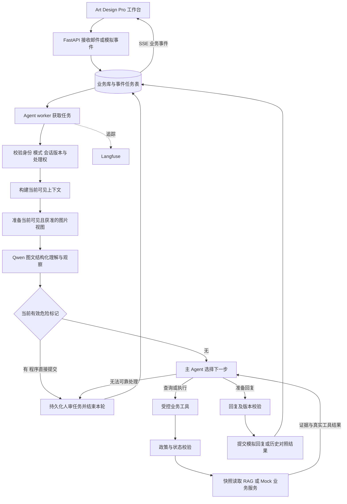

# 后端 Agent 架构推荐方案

版本：v1.5（客户图片理解与售后分流）；日期：2026-10-07（北京时间）。适用：Product-Spec v1.13、BUSINESS-SCENARIOS v1.4 与 data/knowledge/v1 首批资料；新增图片专项仅为待制作/验收设计。

本文件保存整体架构与取舍；具体状态、工具、事务、知识与 API 契约以 [AGENT-ARCHITECTURE.md](../../AGENT-ARCHITECTURE.md) 为详细设计，覆盖及故障验证见 [AGENT-ACCEPTANCE.md](../verification/AGENT-ACCEPTANCE.md)。选型证据以 [TECH-SELECTION.md](TECH-SELECTION.md) 为准，业务范围以 Product-Spec 为准，当前模拟规则以 data/knowledge/v1/policies/policy-profile.json 为准。正式 API、Agent、worker 与业务服务尚未实现；[DEV-PLAN v1.0](../../DEV-PLAN.md) 已将设计拆为13个未开始阶段，政策证据类型修订另建版本，不覆盖v1。

## 1. 结论与取舍

采用模块化单体后端：**上下文意图理解 + LangGraph 状态编排 + 单主 Agent 工具循环 + 确定性业务服务 + 有状态的模拟器 + Langfuse 观测**。

| 架构选项 | 优势与代价 | 本项目决定 |
|---|---|---|
| 固定分类后走七条固定流程 | 常规路径清楚，但同封多诉求、条件退款、客户改方案需要大量交叉分支 | 复用其中确定性的业务校验，避免把整个决策过程固定成七选一 |
| 单主 Agent + 状态图 + 领域服务 | 共享客户上下文，可动态查询与选择动作，同时保证业务状态可检查 | 推荐，首版采用 |
| Supervisor + 七个专业 Agent | 适合上下文或执行权可以分离的任务；当前增加移交、重复理解和状态协调 | 首版不启用；以后根据评测瓶颈按具体能力拆分 |

模型负责理解、补问、选工具、组合证据和表达；程序负责身份范围、政策资格、金额计算、库存占用、幂等、状态转换与持久化。七类是业务能力域，不能据此直接推导为七个 Agent。

## 2. 技术组合

| 层 | 推荐 | 原因与边界 |
|---|---|---|
| 运行时 | Python 3.12、uv | 本机已有该运行时及 uv；复用原邮件系统的 Python 经验 |
| 接口 | FastAPI、Pydantic | 提供类型化业务接口、校验与 SSE 进度；模型 Key 只在服务端 |
| 编排 | LangGraph StateGraph + PostgreSQL checkpointer | 显式管理节点、条件分支、暂停/停止与执行检查点；不自建通用 Agent 运行框架 |
| 模型与工具适配 | langchain-core、langchain-openai 的 ChatOpenAI 接百炼兼容地址；完整 langchain 包满足观测回调依赖 | 结构化输出、流式工具往返与 usage 已做烟测；正式业务语义仍需验收 |
| 主模型 | 已指定的 qwen3.7-plus | 图文联合理解、可见异常观察、决策与回复用同一模型；客户图片专项质量未实测 |
| 数据 | PostgreSQL 18.6、SQLAlchemy 2.1.3、Alembic 1.20.0、pgvector 0.8.6 | 新建业务库；事务和向量检索已完成组件烟测，正式业务约束仍需实现 |
| 向量模型 | 推荐 qwen3.7-text-embedding，1024 维；v4 保留独立空间回退 | 双模型60条开发查询已有实测；正式发布服务与独立评测待验收 |
| PDF 解析 | 复杂/扫描资料默认 MinerU Basic 独立解析进程；轻量 pypdf/pypdfium2 保留 | Standard 为重解析升级路径；关键图片语义仍须核对，不能以OCR命中代替 |
| 任务执行 | Agent worker 与知识 worker 分队列，PG 持久化任务表 | Agent 全局并发1、知识任务并发1；各有租约/栅栏，解析不占邮件槽位，无 Redis/Celery 业务依赖 |
| 观测 | Langfuse 官方 Python SDK + LangChain/LangGraph 回调，业务步骤补 span | 首版纳入调用链、版本和用量观测；业务账本独立保存 |
| 本地基础设施 | Docker Compose | 业务 PostgreSQL 与独立 Langfuse profile；Python/前端可以在宿主开发 |

本机只读检查结果：Python 3.12、uv、Docker、Compose、Node、pnpm 可用；物理内存约 31.8 GiB，16 个逻辑处理器，Docker 服务可响应。上述结果不代表已经运行全套容器或做过资源压测。

依赖采用可复现锁文件，镜像固定经验证的 tag/digest。组件验证见 `globalmail-agent/tech-spike/`：原生 JSON Schema、流式工具往返、usage、Embedding、pgvector、检查点重连和 Langfuse SDK 均有实测记录。该探针不包含正式业务服务；完整 Langfuse 部署、前端构建和并发/进程恢复仍需验收。

## 3. 整体运行图



状态图固定的是输入、校验、执行和保存的骨架；Agent 节点内根据证据动态选择业务工具、继续查询或结束。本次先使用显式 StateGraph 组合框架现成消息/工具组件，不再额外嵌套一套 create_agent 状态机；业务动作由同一领域服务收口校验。

## 4. 意图识别：必须做，支持多诉求与上下文变化

### 4.1 输入与输出

每轮有语义内容的新来信（含仅图片），先做一次结构化理解。输入包含当前正文、获准图片、相关往来、已确认事实、当前待办与人审记录。已知类型的模拟业务事件先直接关联原操作，不为“退款成功回执”再做一次邮件分类。

建议输出 `UnderstandingResult`：

| 字段 | 语义 |
|---|---|
| intents[] | 七类业务中的零个或多个诉求，逐项关联证据邮件、目标订单/商品/包裹和必要条件 |
| message_acts[] | 新请求、补充信息、同意、拒绝、追问、取消/变更选择、确认解决等 |
| problem / desired_outcome | 当前问题与客户希望的解决方式分别描述，例如“配件未到”和“满足条件后退款” |
| entities | 客户原文中出现的订单号、SKU、数量、金额、币种、部件及地址确认线索；提取不等于已查证 |
| conditions / consent | 条件诉求、否定、具体选择及其依据；不能把抱怨或假设当执行同意 |
| missing_information | 当前缺少哪些必要信息，并区分可直接查询和需向客户补问 |
| risk_flags / uncertainty_reasons | 资料矛盾、越权诉求、安全故障等及证据，不把自报百分比视作执行许可 |
| source_message_ids | 支持上述理解的消息来源；提取和后续更正均可追溯 |
| visual_evidence / image_coverage | 原图/派生图及修订来源、原始读数/歧义、可见观察、原因推测、不确定项及逐图状态；understood不等于已核验 |

示例来信：“补寄件还没到，再不到就给我退款。”

- 当前任务：查询补寄件物流、核对异常与查件条件。
- 条件诉求：退款；条件含义或期限不清时需要澄清。
- 已知对象：从案件记忆找补件单及关联订单。
- 本轮不直接退款，也不把整个会话永久归为“退款类”。

七类业务不互斥；“故障”与“要求退款”可以同时存在。一次来信也可能只有确认/补信息，没有新业务类别。同一发信人仍保持一个会话，内部以有来源的多个业务待办组织。

### 4.2 识别结果怎么用

识别结果用于优先加载相关业务说明、字段要求、查询工具和资料；不是不可修改的硬路由。Agent 获得新工具证据后可以修正理解。未知或模糊时保留上下文查询/补问能力，不因分类分数低就直接发起业务操作或统一转人工。

起步不训练独立分类模型，不增加小模型供应商。Qwen 的理解调用与主循环分开可观测，便于区分“理解错”与“工具执行错”。按 Spec 的调用上限，意图理解也占一次模型请求；格式修复、摘要和额外语义复核同样计入，不能隐含无限调用。

业务规则包包含适用说明、字段要求和关联工具 ID，由开发者维护、版本化并与可执行规则对应。用户邮件或检索文档不能动态安装规则包，也不能覆盖系统指令。

### 4.3 客户图片输入与分流

新增AttachmentService负责受控字节、CID/消息绑定、预览、撤销删除；VisualUnderstanding在现有Understanding节点中使用Qwen视觉能力。JPEG/PNG/静态WebP按Spec限额处理，不自动抓远程图/二维码链接、不执行HTML，客户PDF/视频仍未读取；知识MinerU管线独立。

先提取字段/可见观察，再由当前客户订单精确核验型号，结合适用SOP/政策和客户选择补问、指导或提交内部申请。疑似危险即人审，安全分流不等待订单；图片未见异常不否定客户功能故障，不凭外观推断原因/责任/真伪/兼容，不凭截图宣称退款成功。政策需明确允许哪些证据来源满足条件，缺映射时补问/人审。

图像分析与局部复核共用原6次模型/12次工具/120秒预算和输入/输出tokens；无图不新增视觉调用。原图和含个人信息的提取内容默认不进入trace或共享向量库，checkpoint保存受控引用。人工更正、撤销使证据版本及输入版本失效；晚到结果、缓存、恢复数据不能越过处理权/历史范围/删除栅栏。逐图状态、原图与候选/观察/核验在既有工作台抽屉展示。

已识别且仍有处理资格的危险标记由程序与HumanReview同事务持久化、直接接管，不依赖下一次决策模型；余量不足/后续技术失败不能漏掉人审。停止、输入过期、删除和人工权限仍优先，未看清图片的纯技术失败不伪造危险。

详细数据契约、锁序、缓存与清理见 [AGENT-ARCHITECTURE.md](../../AGENT-ARCHITECTURE.md) 第4.4、6.3和8节。客户图片仍只有设计，没有缺陷识别实测或应用实现。

## 5. 自主循环与可靠执行

### 5.1 Agent 循环

采用 ReAct 风格的“判断下一步 → 调工具 → 观察结果 → 再判断”。显式保存的是工具请求、结果、结构化行动依据和状态变化，不保存或要求模型输出隐藏思维链。

Agent 可选择查询、检索、补问、建议方案、提交内部待办、等待或 HITL。人工操作 ERP/平台由场景控制台模拟，形成独立执行记录供 Agent 查询。回复生成由主模型基于已获得的证据完成，不强制每封都多调用一个独立“写邮件 Agent”。

首版所有工具顺序执行，模型同时提出多个动作时逐一核验预算、最新目标及冲突。只读并行保留后续优化入口，需先证明无依赖；写操作始终由领域事务串行保护。

### 5.2 工具和业务权限

| 工具组 | 能力 | 执行规则 |
|---|---|---|
| 上下文 | get_case_context、读取关联原文 | 身份、模式、时间截点由服务端绑定 |
| 订单/物流 | get_order_snapshot、get_shipment_status | 对指定订单/包裹查询，区分未知、无记录、技术失败 |
| 知识/政策 | search_reference、get_after_sales_context | 返回来源、版本、适用范围，政策授权由结构化规则判断 |
| 商品/库存 | get_item_availability | 查询 SKU/部件/地区兼容及库存，不按名称猜匹配 |
| 资格 | check_after_sales_eligibility | 程序检查客户选择、政策、时间、余额、数量、库存和既有补偿 |
| 内部申请及执行查询 | create_after_sales_operation、get_operation_status、cancel_after_sales_operation | Agent 只创建/取消内部待办并查询关联执行单；模拟人工建 ERP/平台单据由控制台推进，历史回放拒绝写工具 |
| 沟通/状态 | create_reply_draft、update_case_state、request_human_review | 证据引用、版本检查、提交去重与人审处理权 |

写入前重新校验最新业务状态，不把前一次资格检查结果当永久许可。金额按主架构统一保存和计算为最小货币单位整数并明确币种，外部十进制输入只在边界精确转换；禁止模型凭自然语言修改额度、币种、库存或完成状态。

只读真实快照与模拟查询均返回明确来源。当前以模拟业务数据表达接近真实的售后流程，不要求生产 ERP 具备对应查询或写接口。未来真实接入单独处理授权、撤销和未知结果对账，不阻塞本期数据准备与开发。

### 5.2.1 内部待办与模拟人工执行

- Agent 创建 `AfterSalesOperation`，返回内部待办号；它不等于 ERP 补发单号、退款流水或物流单号。
- 场景控制台接收模拟人工操作，创建 `ExecutionRecord/Reshipment`，绑定原订单、商品行、内部待办及模拟分支。无需复刻 ERP 界面。
- `get_operation_status` 查询待办及关联执行记录；物流工具查询其包裹。一单多次补发时按本次事项关联，不能按发信人或原订单随便取第一条。
- 查询到变化后触发待办继续处理；查不到、尚未同步、关联缺失与技术失败分开表示，可提供手工关联/回填备用入口。
- 后台任务按等待条件同步状态，不持续调用模型；无新结果不反复发信。正常业务等待与 HITL 接管采用不同状态门禁。
- 首封售后登记是素材来源，不能复用为执行账本；“已核对”不能成为退款/补发成功证据。

### 5.3 事务与任务

- 来信/业务事件与待处理任务在同一事务写入。API 返回任务 ID，worker 执行，浏览器断开不会丢任务。
- 首版 Agent 独立 worker 全局并发1，知识 worker 单独并发1；领取采用短事务与行锁，执行模型/解析时不持长事务。详细设计区分 input_revision、authority_epoch 与 Agent 自身 case_revision，避免自己更新记忆使本轮失效。
- 重复触发事件由唯一键拒绝。后到邮件使旧上下文失效；旧运行不得提交未发出的回复或新业务动作。
- 内部待办及数量/额度约束在申请事务保存；模拟履约单和库存占用在对应控制台执行事务保存，再产生关联事件。两者分别去重，不能靠更换请求 ID 绕过同一事项的补偿约束。
- 模型检查点与业务库事务不视为原子提交。工具重放先按幂等键查询已存在结果，避免“业务成功但检查点没保存”造成重复执行。
- 写操作结果未知先查询原操作号；停止任务不抹除已发生的操作。进程重启后不盲目重放写入，向用户展示已中断和显式重试入口。
- 运行状态、工具结果摘要和供前端使用的事件存业务库；SSE 通过事件游标支持刷新后补读，连接恢复不启动新 Agent。

## 6. 三层状态与 HITL

| 层 | 持久化内容 | ID / 用途 |
|---|---|---|
| 客户会话与记忆 | 消息原文、提取事实/来源、所有待办、客户选择、人工回复、当前处理权 | conversation_id；模式与模拟分支隔离，同一发信人持续归组 |
| 一轮 Agent 执行 | 当前可见输入、工具消息、理解结果、步骤/预算和检查点 | run_id；建议 LangGraph thread_id 使用独立 run_id，显式加载会话事实 |
| 业务操作账本 | 内部售后待办、模拟人工执行单、库存占用、物流和回执 | operation_id 与 execution_id 分开，关联原订单；状态以业务服务为准 |

### 6.1 人工接管

采用持久化的**业务暂停**：产生 HumanReview 并结束本轮自主执行，阻止会话继续自动操作。人工处理可延续多封来信，期间事件照常记录，但没有后台 Agent 抢处理权。

人工回复完成后设置 `resume_on_next_customer_message`。下一封新客户来信清除该等待条件，从最新邮件、账本和人工事实启动新 run。禁止直接恢复旧的退款/补件调用。LangGraph checkpointer 用于运行追踪与故障恢复；本版不把 human reply 简单映射成对旧工具的 `Command(resume=True)`。若以后增加单项操作审批，再独立使用框架 interrupt 协议并做过期动作校验。

### 6.2 正常等待与风险

自动处理中的待办可由匹配的模拟业务事件唤起，例如仓库收件后继续核对退款条件；重复事件、无关事件和人审后等待客户的事件不能触发重复运行。

人工完成补发等业务操作不自动把整个会话切换到 HITL。只有显式接管才撤销 Agent 处理权；同一份物流回执在正常等待中可唤起跟进，在 HITL 或人审回复后待客户状态中只更新信息。

HITL 的依据包括：无适用资料、政策矛盾、反复失败、权限或业务条件不满足且需要例外、客户诉求无法可靠确认。明确的资料缺失先补问；工具连接异常记录技术失败。模型可以报告不确定因素，但不采用“置信度超过某百分比就允许退款”的规则。

## 7. RAG 与记忆

### 7.1 资料处理

上传原件/新建不可变版本 → 解析规范结构与适用绑定 → 人工核对 → 切分/Embedding → 校验完整构建 → 显式发布一致清单。旧版持续服务直至新版本成功切换；详细契约见 AGENT-ARCHITECTURE 第7节，维护方案和实测分别见 KNOWLEDGE-DESIGN、KNOWLEDGE-VALIDATION。

用户已确认继续 PG 路线。资料准备以模拟含图 PDF、内部 MD、JSON 适用关系及结构化政策交付。PDF 保留页码/图号和解析质量，编辑源仅用于重建，不能替代 PDF 入库验收。知识服务通过受控接口查询；未来引入图数据库须明确查询收益和版本同步，不作为本期依赖。

资料清单记录来源、版本、用途、模式、available_at 与启用状态；适用关系以独立绑定清单为准，可具体到章节。SKU/型号/地区必须精确符合或存在显式共享关系，分类/前缀不能推导兼容。政策与实时状态通过业务服务查询，RAG 只返回解释与证据。模拟政策 MD 从 JSON 生成。

资料入口以 `data/knowledge/v1/documents.json` 与适用绑定为准，已有 22 个逻辑文档及 5 个审读案例；其余生产候选不得直接入库。视频题名与产品前缀只是候选，SKU 适用性和内容证据需分别记录；OUTONLIFE 不自动继承 OUTON 资料，BELEEV 非滑板车材料不进入本项目知识范围。

首版用 pgvector 精确向量搜索加 SKU/部件编号精确匹配；检索前应用用途、历史截点、Mock 模式与SKU—品牌成对适用过滤。短SOP/案例完整保留，长文结构切分，按父文档去重补上下文时再次校验父资格和正文摘要。中文词面召回不能用默认英文全文配置冒充完成；关键词融合、HNSW、reranker 均在评测出现明确收益后再引入。

Embedding 推荐 qwen3.7-text-embedding 1024维，v4保留独立已构建索引才能回退；同维不等于同空间。查询与文档依据同一发布manifest选择profile；模型/切分更换全量构建候选manifest后切换。正文和原件是恢复依据，向量可重建。发布/下架和回复提交在同一知识head锁下复核，清理覆盖检查点、摘要、缓存及本地trace，不能只删除向量行。

### 7.2 知识与事实

说明书回答“怎样操作”；案例提供“类似问题的处理经验”；政策规则决定“当前允许做什么”；订单/账本回答“实际发生了什么”。历史客服退款承诺不自动升格为已成功回执，类似案例也不能作为当前客户的售后授权。

结构化案件记忆保存已确认事实及来源，长历史按预算整理并可回查原文。原文、模型推断、人工确认分别标记。历史回放只读取截点前资料；业务模拟基于独立分支，保留真实来源字段与 Mock 增补字段，不能污染独立 eval。

## 8. Langfuse：首版接入，明确观测边界

### 8.1 三类记录各自负责什么

| 记录 | 存放位置 | 作用 |
|---|---|---|
| AI 调用链 | Langfuse | 查意图判断、Prompt/模型版本、检索命中、工具调用、耗时、token、失败及评分 |
| 业务操作与前端事件 | 业务 PostgreSQL | 保证退款/补件是否发生、谁接管、何时恢复、页面可重建；是业务事实来源 |
| 应用技术日志 | 结构化 JSON 日志 | HTTP/worker/数据库错误、任务领取、异常堆栈及 trace/run 关联；默认不含正文或凭据 |

Langfuse 可帮助定位“为什么没有解决”：识别错、检索错、业务条件不足、工具失败或回复不符合证据。不记录模型隐藏思维链，用结构化决策依据及引用支持排查。

### 8.2 埋点树与关联字段

```text
mail_agent.run                        一个触发事件、一轮 trace
├─ context.load
├─ understanding                      意图/实体/条件理解 generation
├─ agent.model_call[1..N]              模型 generation
├─ retrieval.search                   查询、过滤条件、资料 ID/版本及排序
├─ tool.order / shipment / inventory  输入与结果摘要
├─ policy.evaluate                    规则 ID、资格、缺失条件与拒绝原因
├─ operation.submit / reconcile       操作 ID、类型、模拟标记和结果状态
├─ response.validate
├─ reply.commit 或 hitl.create
└─ outcome                            本轮结果与评分关联
```

- `session_id` 对应模式/分支下的客户会话，trace 对应 run。跨天 HITL 后的新来信有新 trace，以 conversation_id 和 human_review_id 关联，不保持一个跨多天的巨型 span。
- 关联 run_id、event_id、conversation_id、operation_id、模型/Prompt/政策/知识版本、业务类别、运行模式和终止原因；客户标识使用演示 ID，不以邮箱/地址作为标签。
- 模型调用使用 Langfuse 官方 LangChain/LangGraph callback；业务校验、事务提交等加手动 span。避免同时启用重复的底层模型自动埋点而双计 token。
- 后台 worker 独立创建 trace，并以 event/run ID 关联 API 入库请求；上下文必须正确跨异步调用传播，不能把其他会话的工具挂进本轮 trace。
- 记录 provider 实际 usage。费用只有价格映射经核验才估算；未知价格显示未知，不把 token 估算当账户扣费。意图理解和主循环分别计量，总预算统一限制。

### 8.3 脱敏、可靠性和版本

推荐本地自托管，业务内容不默认发送 Langfuse Cloud。采用字段白名单、内容脱敏及 SDK 导出层过滤；覆盖输入、输出、metadata、错误日志和第三方回调。真实地址、邮箱、订单直连身份与 API Key 不进入 traces；纯合成场景可以保留完整演示内容。

当前官方 Python 文档推荐导出层 `mask_otel_spans`，旧的 `mask` 不能覆盖所有第三方 OpenTelemetry 属性。实现须以锁定 SDK 版本验证该能力；仅用正则处理自由文本不能宣称完全去标识化，未经复核正文默认只记录内容引用/结构化摘要。

Langfuse 导出走有界异步批处理，失败不能阻塞客户处理或业务事务；本地数据库保留业务与运行摘要，并标识观测导出异常。离线期间不保证完整 AI span 无损回传，也不能为补齐 trace 重跑已执行业务。退出时受限 flush；脱敏失败丢弃观测内容，不能回退明文。

Prompt 第一版由代码仓库版本化管理，trace 记录 prompt_version/hash；Langfuse 负责展示与实验比较。以后使用 Prompt Management 时，显式发布指定版本并保留本地回退，不同时维护两个自动生效的真相源。

### 8.4 部署方式

使用官方自托管 Compose 作为独立观测 profile，包含 Web/Worker、PostgreSQL、ClickHouse、Redis/Valkey 和对象存储等依赖，按所选发布版本检查官方清单。它有额外资源成本，不是装 Python SDK 后就已经拥有日志平台。

业务数据库与 Langfuse 数据库使用不同库、凭据与数据卷；Langfuse 的 Redis/ClickHouse 不成为业务运行依赖。Langfuse UI 建议映射到 3001，避开前端示例的 3000；仅绑定本机并在启动前检查端口。基础业务可单独启动，标准验收环境需启用观测 profile 验证追踪。

官方单机 VM 指引建议至少 4 核/16 GiB；本机资源具备试运行基础，但实际 Docker 分配、其他应用占用和运行效果仍需测量。若本机负担过重，保持同一埋点接口，将观测服务放到用户自有环境；不自动改为向第三方云端传输正文。

## 9. 验证方案

30 个业务场景继续全覆盖，增加以下横切检查，不以“API 返回成功”代替业务通过。

| 层面 | 验证重点 |
|---|---|
| 意图与理解 | 七类多标签、同意/否定、条件退款、主体订单/数量、方案变更；记录遗漏与误执行，不只算单标签准确率 |
| 客户图片 | 图片文字候选精确核验、可见异常与正常/反光负例、功能故障不被否定、正确补问/指导/人审；危险分流、图文冲突、逐图覆盖、隐私及删除晚到栅栏 |
| RAG | 指定 SKU 的资料命中、英德邮件查中文说明、不同型号/时间/用途排除，引用可追溯 |
| 执行 | 金额/币种/数量、库存、互斥补偿、原操作查询、失败/未知结果、重复事件、停止和进程重启 |
| HITL | 人审期间没有自动动作；人工回复后事件不抢占，下一封新来信恢复；新 run 不执行过期旧方案 |
| 回复 | 不重复失败建议、不把受理写成成功、语言正确、所有执行声称能关联账本回执 |
| 观测 | 同一轮 trace 完整关联，模型 usage 不双计，敏感字段不出站，Langfuse 不可用时业务仍完成 |

确定性规则由自动断言验证，复杂表达由人工评分，LLM judge 只作辅助且输入不得回流进 Agent。30 个专项开发场景至少重复 3 次，并运行新增 21 条连续流程，按业务类别与版本报告结果；新工作集的 10 个 eval_holdout 仍待复核标注，不能沿用旧包 20 条评测。Langfuse 用于对比实验与评分展示，不能把模型给自己的评分当最终真值。

## 10. 实现组织与准备项

业务代码位于 `globalmail-agent/backend/`，推荐模块：

```text
src/globalmail_agent/
  api/                 会话、人审、业务单、SSE、场景控制接口
  application/         事件入口、任务调度、处理权和业务用例
  agent/               StateGraph、理解 schema、上下文、Prompt、工具注册
  attachments/         受控图片、视图、视觉证据、人工更正、撤销与清理
  domain/              会话/待办、政策校验、售后状态和交易约束
  adapters/            百炼、准备包读取、Mock 业务服务、数据库适配
  knowledge/           导入、切块、向量化、条件过滤与检索
  observability/       callback/span、脱敏、关联 ID、结构化日志
  worker/              持久化任务领取、执行、停止与中断恢复
tests/                 规则、工具契约、图运行、七类业务回归
```

这是架构分工建议，不是已创建文件清单。DEV-PLAN 再按可验收交付拆具体文件和任务。

技术验证与后续集成门槛（组件完成范围见 TECH-SELECTION）：

1. Qwen 结构化意图输出、工具往返与流式结果可以被选定模型适配器正确处理，usage 可提取。
2. PostgreSQL checkpointer 与业务幂等配合，验证事务完成/检查点未保存时不会重复模拟交易。
3. Embedding Key 授权、1024 维实际输出、SKU 过滤和跨语言召回通过。
4. Langfuse callback、手动 span、异步关联、导出层脱敏及离线降级通过。
5. 使用已准备的 72 个场景输入与政策；真实工作集剩余复核及跨源发信人映射继续独立处理，未审读候选不入索引。不要求验证生产 ERP。
6. 新增VIS-001至VIS-018图片专项样本与真实模型验证列为前置风险实验；当前尚未制作，不把原产品PDF烟测成绩替代客户图片质量或增加已制作输入数量。

本方案不增加真实发信、真实财务/物流操作、自动联系工程师、通用 Shell、浏览器自动化、模型自改政策等能力。

## 11. 官方依据

以下是前期选型依据；2026-10-07 架构细化另核对检查点重放/durability、interrupt副作用、PG队列锁及自托管部署，直接来源链接见 AGENT-ARCHITECTURE。保留前期向量模型链接供比较基线，不表示重新选择v4为主模型。

- [LangGraph 概览](https://docs.langchain.com/oss/python/langgraph/overview)：编排、持久化与模型驱动步骤的组合。
- [工作流和 Agent 模式](https://docs.langchain.com/oss/python/langgraph/workflows-agents)：路由、工具循环与结构化输出示例。
- [LangGraph 持久化](https://docs.langchain.com/oss/python/langgraph/persistence)：检查点机制；业务事务仍由本应用处理。
- [Qwen3.7-Plus](https://help.aliyun.com/zh/model-studio/qwen3-7-plus)：北京地域支持工具调用与结构化输出。
- [text-embedding-v4](https://help.aliyun.com/zh/model-studio/text-embedding-v4)：多语言向量模型与可配置维度。
- [pgvector](https://github.com/pgvector/pgvector)：PostgreSQL 向量检索与索引维度限制。
- [Langfuse LangChain/LangGraph 集成](https://langfuse.com/integrations/frameworks/langchain)：callback 接入方式。
- [Langfuse 脱敏](https://langfuse.com/docs/observability/features/masking)：导出层过滤及覆盖范围。
- [Langfuse 自托管 Compose](https://langfuse.com/self-hosting/deployment/docker-compose)、[平台架构](https://langfuse.com/handbook/product-engineering/architecture)：部署依赖与资源要求。

以上用于验证能力存在，不代表本项目已验证所有组件组合。最终选定版本、实际命令与测试结果写入实施交付记录。
