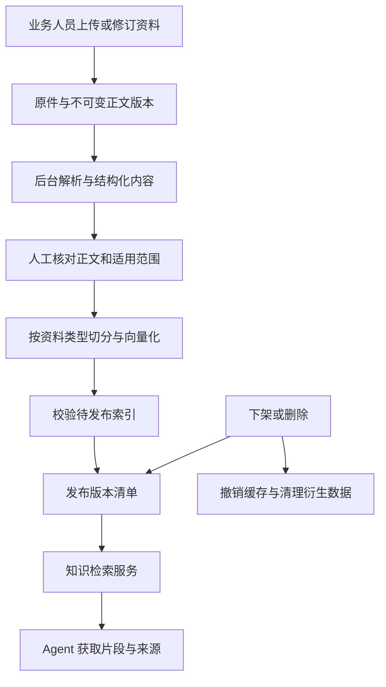

# 知识管理与入库方案

版本：v1.3；日期：2026-10-07。对应 Product-Spec v1.13。具体服务/发布/删除契约已纳入 [AGENT-ARCHITECTURE.md](../../AGENT-ARCHITECTURE.md) 第7节，供后续开发计划使用；知识管理页面、正式管线尚未实现。专项实测和局限见 [KNOWLEDGE-VALIDATION.md](../verification/KNOWLEDGE-VALIDATION.md)。

本版边界增量：客户订单截图/故障照片及其提取文字、视觉观察属于会话证据，按 REQ-014 与架构第4.4节处理，默认不进入共享知识索引；受控知识PDF仍走本文的解析/核对/发布流程。不能把客户图片直接送MinerU后发布为SOP或政策；将来提炼知识需另行授权、隐私复核、人工审读及发布，本轮未开放该自动转换。

采用业务人员维护资料、系统自动管理衍生索引的方案：保存原件和不可变正文版本，在 PostgreSQL 管理适用范围、发布与任务，在 pgvector 保存可重建向量。专项实测后，复杂/扫描 PDF 推荐 MinerU Basic，Standard 为升级路径；Markdown 直接读取，政策从结构化规则生成说明。推荐实测排序更好的 qwen3.7-text-embedding 1024 维作为下一阶段主候选，text-embedding-v4 保留比较基线；模型空间分别管理。

## 1 规划与完成标准

| 步骤 | 目标 | 本次完成标准 |
|---|---|---|
| 核对现状 | 区分资料准备、组件验证与正式能力 | 指出已有增删范围及缺口，保留原探针结果的适用范围 |
| 明确维护流程 | 业务人员能持续修改知识 | 给出责任分工、页面操作、版本与删除语义，并同步需求冲突 |
| 设计入库与检索 | 可以替换解析器和模型，不丢原件与引用 | 给出数据分层、切分初值、更新策略、检索边界及失败行为 |
| 规定验证 | 用项目证据决定选型 | 给出解析对照、检索与生命周期验收，不把待做实验说成已完成 |

本次完成以上设计与源文档自检；下面的运行验收是后续实现标准。

## 2 已有基础与缺口

现有 REQ-005、REQ-010、AC-030 已要求资料导入/移除、索引更新和旧引用追溯。此前未规定可供业务使用的修订入口、原子发布、版本回滚、增量重建、彻底删除与晚到任务之间的关系，不能据此视为长期知识维护已完成。

首批是 22 个逻辑文档：8 份产品参考、8 篇 SOP、5 篇审读案例、1 份政策说明。产品参考共用一个 17 页 PDF，通过页码区间与适用绑定区分。真实商品信息和图片、案例来源与模拟补全并存，当前整个知识包仅允许 simulation。将来应创建经过核对的正式版本，不能把当前文件整体改一个标签便投入真实业务。

既有技术探针对 22 个整篇逻辑文档进行了向量化。16 条英德正例中，无 SKU 约束时 top1 命中 14 条；加 SKU 约束后 16 条目标资料进入 top5，8 条未知 SKU 返回空。该结果证明模型接口与范围过滤可用，未验证正式切块效果；每个 SKU 候选仅少数几篇，top5 不能当作高精度证明。证据见 [技术选型](TECH-SELECTION.md) 与 [provider-results.json](../../globalmail-agent/tech-spike/provider-results.json)。

## 3 谁维护以及页面如何使用

以下是本项目的推荐职责分工，不要求初期就具备多个岗位或账号。

| 内容 | 内容责任人 | 技术人员的职责 |
|---|---|---|
| 产品参数、说明与适用型号 | 产品/商品负责人，必要时向供应商核对 | 提供上传、解析预览与 SKU 绑定功能 |
| 排障与安装 SOP | 售后负责人 | 保留步骤、前提、警告和版本，提供回滚 |
| 售后案例 | 客服提交，售后负责人筛选核对 | 脱敏、去重、保留来源，不自动收入全部会话 |
| 退款、退换货及补件政策 | 售后与运营负责人；涉及金额口径时按企业实际安排财务参与 | 校验结构化规则，生成说明，同版发布 |
| 解析、索引与运行保障 | 技术人员 | 处理任务失败、模型升级、备份恢复与性能 |

初期由用户兼任维护和发布者，记录实际操作者及核对动作。多人登录、按品牌授权、双人审批在多人/联网阶段补充；有操作日志不等于已实现企业权限控制。Agent 可以提出知识补充候选，但不能自动修改全局 SOP 或政策。

在 Art Design Pro 导航增加最小“知识管理”页面。列表显示类型、品牌/SKU、用途、当前生效版本、待发布版本、最近维护时间及任务状态。详情使用现成表单/抽屉：

- 上传 PDF、导入 Markdown，或新建/修订 SOP 与案例正文；PDF 修改采用替换原件，解析纠错另存带来源的修订版本，不伪装成原 PDF 文字。
- 并排核对原件与解析结果，查看漏页、图片/表格、适用章节和缺失警告；PDF 内的内容即使可提取，也不自动表示经过业务核对。
- 政策通过结构化字段或受校验的 JSON 导入修订，自动生成只读说明；不提供两个可以各自修改的规则来源。
- 查看差异、发布、回滚、下架、彻底删除；保存草稿与发布是独立操作。页面展示受影响版本、引用和任务。
- 输入提问及 SKU/用途试查，查看实际引用片段及未命中原因；错误重试和后台进度可查询。

批量文件导入与页面上传复用同一知识服务和校验，不能为脚本开放绕过发布的直接写向量路径。

## 4 四层数据与服务边界

| 层 | 保存什么 | 初期实现方向 |
|---|---|---|
| 原始资料 | PDF 原件、MD/规则编辑源、图片、文件摘要 | Git 忽略的应用数据目录，按不可变对象键保存；通过存储接口访问，后续可迁移对象存储 |
| 规范内容 | 标题层级、段落、步骤、表格、图片关联、原件定位和人工修订 | PostgreSQL 记录版本/索引元数据，较大的解析产物按对象保存 |
| 检索索引 | 带适用范围的父子块、正文、向量输入摘要、向量与索引配置 | PostgreSQL + pgvector；向量与原件脱离后仍可重新生成 |
| 发布与审计 | 当前发布清单、下架/删除状态、任务、操作记录与引用版本 | PostgreSQL 事务控制；不依赖向量服务或模型判断发布是否有效 |

实体职责：`KnowledgeDocument` 稳定身份；`DocumentVersion` 内容版本；`KnowledgeBlock/Chunk` 结构及片段；`Applicability` 章节适用绑定；`EmbeddingProfile/IndexBuild` 索引配置与构建；`ChunkEmbedding` 向量；`KnowledgeRelease` 发布清单；`IngestionJob/KnowledgeAudit` 任务与事件。表职责、关键约束及 API 见 AGENT-ARCHITECTURE 第7至8节，迁移和服务在开发阶段实现。

引用必须包含 `document_id/version_id/chunk_id`、原件摘要、页码/章节/图表位置、发布及索引版本。当前一个 PDF 对应八份逻辑资料：可以复用原件和整份解析产物，随后按 manifest 的逻辑页区间/章节分配适用范围；不能因为同一物理文件而合并八种产品的检索权限。清理共享对象时检查仍被哪些版本引用。

原件与业务元数据是恢复依据；只备份向量不够。初期备份数据库、文件对象与配置指纹，执行一次联合恢复与重建演练。删除登记独立保存，恢复旧备份后先重放删除状态，再开放读取，避免已删除资料复活。

## 5 增删改查与发布一致性

| 操作 | 用户看到什么 | 后台必须保证什么 |
|---|---|---|
| 新增 | 待核对、索引中、待发布等状态 | 原件落盘并校验摘要后排任务；草稿和半成品不进入正式检索 |
| 查询 | 筛选资料、查看原件/历史版本、检索试查 | 管理预览与 Agent 检索分离；Agent 只读取允许且已发布的版本 |
| 修改正文 | v2 草稿及与 v1 的差异 | 新建不可变版本；v2 完整就绪并发布前，v1 继续服务 |
| 修改适用范围 | 显示新增/移除哪些 SKU、模式或有效期 | 生成可审计的新版本/发布记录；实际向量输入不变时复用向量，过滤立即按新发布生效 |
| 回滚 | 选择可恢复的已核对历史版本 | 建立新的发布事件，不改写历史；已撤销/已删除或模型不兼容的构建不可直接激活 |
| 下架 | 立即显示已下架 | 先撤销发布资格，再异步处理缓存；不能等向量物理删除才阻止命中 |
| 彻底删除 | 清理中、部分失败或已删除 | 先下架并设置删除栅栏，停止相关任务，清理应用内原件副本及衍生内容；失败可恢复重试 |

入库状态按内容版本推进：`draft → parsing → needs_review → indexing → ready`；`failed/cancelled` 保存失败阶段。发布是独立事务，只有已核对且完整的 ready 构建可进入发布清单。审核后再修改正文或重新解析，会使已有核对失效。

发布事务锁定对应发布范围，校验预期发布代次、版本状态和构建完整性，再替换清单、关联政策版本并递增代次。一次检索在一致快照中读清单和片段，不能一半来自旧版本、一半来自新版本。整库更换模型也使用待发布清单，不逐条覆盖在线向量。

任务键包含文档版本、解析/切分配置与 Embedding 配置。worker 使用持久化任务、租约、超时与有上限重试；重复任务可以复用产物，但不能重复发布。任务结束及发布前再次检查文档删除栅栏和预期代次；旧任务晚到只记录失效，不把 v3 覆盖成 v2。

Agent 取得引用后还可能正在生成回复。因此在提交回复及执行相关动作前，服务端再检查引用是否下架、删除、过期或被必须生效的新版本替代；变化时重新检索/生成，仍无法取得有效依据则按既定规则转人工。业务操作校验与知识检索分开，不能由模型自行判断旧引用仍可用。

缓存键包含用途、SKU/适用条件、历史截点、发布代次、索引配置和查询摘要；命中缓存也需检查撤销状态。正文副本可能存在于 tool 结果、检查点、摘要和 trace，彻底删除须追踪并清理本项目控制的这些副本。历史引用仅保留不含正文的删除占位；普通下架可以保留带停用标记的审计快照。已外发邮件、外部提供商留存及离线备份不能被本地“删除完成”一并承诺清除，应明确范围与保留策略。

政策调整同样不能抹去已执行账本与已记录承诺。规则与说明同版发布，新决策按结构化适用条件和生效时间取版本；既有业务操作继续引用当时的政策依据，变更与承诺冲突时进入人工判断。

## 6 解析方案与 MinerU 的位置

截至本次核对，官方最新发布为 [MinerU 4.0.10](https://github.com/opendatalab/MinerU/releases/tag/mineru-4.0.10-released)。其能力包括文档解析、结构化输出以及本地文档库/读取工具；本项目主要通过解析适配器消费其结果，仍由自己的知识服务管理 SKU、simulation/eval 隔离和发布。

| 输入 | 推荐路径 | 选择条件 |
|---|---|---|
| 自编 SOP/案例 Markdown | 直接读取标题、列表和正文结构 | 没有必要先转 PDF 再 OCR |
| 政策 JSON | schema 校验后确定性生成可读说明 | 金额、资格、窗口期由规则服务读取原结构 |
| 带文字层、简单版式 PDF | 保留现有轻量解析作为已验证基线；与 MinerU 对照 | 确保完整页数、阅读顺序、图文定位及章节适用性 |
| 扫描、复杂表格、多栏 PDF | 默认已实测 MinerU Basic；Standard 为显式升级重解析路径 | 关键参数、警告和表格结构更值得投入解析成本 |
| 需要理解的操作图片 | 原图 + 图注/邻文；必要时单独视觉提取并核对 | OCR 读到字不等于理解接线/安装关系，不能生成未经核对的操作事实 |

MinerU 将质量档位与运行后端分开：Basic 可用 CPU，Standard/Advanced 涉及视觉模型，实际资源取决于引擎、页面和并发。本机 RTX 5060 Ti、8151 MiB 显存；单任务 Basic/Standard 已完成专项比较，但未做稳定吞吐/GPU峰值压测，不能根据显卡名称承诺性能。[官方档位与运行要求](https://opendatalab.github.io/MinerU/usage/tiers/)

解析服务放独立进程/容器或虚拟环境，保持重型依赖与主 Agent API 隔离。知识解析使用独立 worker 队列/资源配额，不能阻塞邮件运行；复用 PostgreSQL 任务基础设施即可，初期不引入新的队列中间件。应用对外只依赖自身的 `DocumentParser` 契约，包含格式、页面覆盖、块、图片关联、诊断、解析器/模型版本与输入摘要。

保留 MinerU 原始中间结果，并映射为自己的规范块；不把所有结构扔掉后只存 Markdown。不同入口暴露的结果格式不同，适配器需检查 schema 和完整页覆盖；原始零基页号转换为用户看到的一基页码并有映射测试。[官方输出契约](https://opendatalab.github.io/MinerU/reference/output_files/)

MinerU 4.0.10 的许可是 Apache 2.0 加附加条款，包含合并口径的商业规模门槛和向第三方提供在线服务时的标识要求；集成时保存对应版本许可，并分别核对所选模型权重许可。[固定版本许可证](https://github.com/opendatalab/MinerU/blob/mineru-4.0.10-released/LICENSE.md)

备选 Docling 提供文档结构处理，其 HybridChunker 在结构分块后根据 tokenizer 调整大小，支持表格重复表头。这里采纳结构优先的设计思路，不代表已安装该组件；若 MinerU 在困难样本、资源或许可适配上不合适，再以同一验收集对照 Docling，避免首版并行维护两套完整重型解析器。[Docling](https://github.com/docling-project/docling)、[切分说明](https://docling-project.github.io/docling/concepts/chunking/)

## 7 切分策略

本轮 22 份资料普遍较短，强行按标题拆成大量小块会使同一资料占满 top5。正式策略应先判断内容是否足够短且适用范围一致：短 SOP/案例整体保留；只有过长资料才细分。召回后按父文档去重、在相同适用范围内补齐上下文。当前 300/500 两档在样本上产生相同输入，未确定长文最优参数；以下数值继续作为长文实验初值。

先按业务适用范围和文档结构划分，再用 token 预算处理过长内容。下表是实验初值，不是实测最优值。

| 资料 | 最小完整语义单元 | 初始切分策略 |
|---|---|---|
| 产品说明 | 同一适用范围内的一个主题，例如遥控配对 | 标题路径 + 条件 + 正文；目标约 300–600 tokens，过长时在完整段落/步骤边界细分 |
| 排障 SOP | 前提 + 操作步骤 + 预期结果 + 停止/升级条件 | 短流程完整一块；长流程建立父块和约 300–600 tokens 子块，每个子块带必要前提与警告 |
| 案例卡 | 问题现象 + 已尝试动作 + 已知结果及限制 | 短案例整卡；超过约 800 tokens 再按阶段切，标明这是经验且不能代替当前授权 |
| 政策说明 | 一条规则的适用条件、例外与解释 | 每条规则/主题一块，绑定结构化规则 ID/版本；不能把条件、金额与例外拆散 |
| 参数或兼容表 | 表头、单位及一组同适用范围的完整行 | 重复表头/单位，按行组拆；SKU 对应关系进结构化适用表，不能只留在向量文本里 |
| 图片及图注 | 图、图注、相邻步骤及原页位置 | 与相关步骤关联；机器生成描述单独标识，核对前不可作为独立操作依据 |

单个子块一般不超过约 800 tokens；确需保留完整语义时可放宽至约 1000，过大的父块通过受限展开读取。只在同一长章节连续拆分时保留约 50–80 tokens 的邻接重叠；独立案例、不同型号、政策版本和不同用途绝不靠 overlap 拼接。这些预算包含将实际送去 Embedding 的标题与前缀。

采用“子块召回、同范围父块补全”：检索命中遥控器步骤后补齐该流程前提和警告；父块及邻块也必须重新验证 SKU/用途/版本，不能因为子块命中便把整本说明书放进上下文。返回内容受 Agent 上下文预算限制，重复块去重。

初期不使用 LLM 自由重写每个切块，也不使用无条件的语义分割模型。步骤和数值先忠实保留；需要补充便于检索的描述时与原文区分，人工核对后发布。tokenizer 尽量与 Embedding 模型匹配；无法确认服务端 tokenizer 时使用保守估算并记录方法，对超长响应重新切分，不能把字符数当作准确 token 数。

## 8 Embedding 与增量更新

保留已经接通的 `text-embedding-v4`、1024 维作为比较基线，后续主候选推荐同维 `qwen3.7-text-embedding`。本轮固定开发查询的完整短文首位证据命中为新模型 29/36、v4 18/36；去重并补父文档后两者覆盖相同，因此不能把新模型宣传为全面更优。v4 北京同步接口每批最多 10 条、每条最多 8192 tokens，切块目标应显著小于这个硬上限。[官方 Embedding API](https://help.aliyun.com/zh/model-studio/text-embedding-synchronous-api/)

配置必须记录 provider/地域/端点配置标识、模型名、可获得的模型修订、维度、归一化约定、查询/文档输入格式及 tokenizer/切分版本。只有供应商返回或官方提供修订号时才能声称锁定权重；否则记录模型别名和调用日期并运行固定探针检测漂移。查询与文档使用同一空间；即使维度相同也不能混用两个模型。

向量输入采用“文档标题 + 章节路径 + 必要语义前提 + 块正文”；SKU 列表、访问用途等作为结构化过滤字段，不靠向量识别权限。唯一复用键基于完整向量输入摘要和 Embedding 配置，不仅依据原文件摘要。改变标题、前提或单位也可能触发重新计算。

- 相同文件重复导入：识别原件摘要，但仍核对逻辑文档身份与页区间；不同逻辑文档可以共享原件，不能被错误折叠为一份资料。
- 只改不进入 Embedding 的过滤字段：创建适用版本并更新发布，复用向量；收窄范围时同步撤销缓存与运行依据。
- 改正文：对新版本重新确定受影响章节/块；相同向量输入复用，变化的块重新计算。段落长度变化导致相邻边界移动时，这些邻块也属于变化范围。
- 改解析器、切分器或模型：创建独立索引构建，完成对照和全量覆盖后切换发布清单；原始资料与旧可用构建保留用于恢复。

后台按供应商限额分批、限速与退避重试，验证返回数量、维度及有限数值。部分批次成功不等于可发布；取消或删除后的响应不能回写成有效索引。记录处理页数/块数、实际 usage、失败原因和耗时，用实际数据估算维护成本。

## 9 查询与知识更新后的行为

服务端先确定发布快照和适用候选：品牌、明确 SKU 绑定、资料类型、用途/split、当前撤销状态与时间。历史评测还需独立的索引清单、已核实的来源可用时间与 `as_of`；本项目整理时间不能冒充历史可用时间，当前 simulation 包仍不得参与真实历史评测。

小库使用 pgvector 精确余弦检索，并保留型号、配件码等精确匹配。精确搜索的“完整近邻召回”只表示找到向量距离最近者，不等于语义答案正确；规模扩大后是否用 HNSW 取决于实测延迟，且要重新检查带过滤条件的召回。[pgvector 官方说明](https://github.com/pgvector/pgvector)

检索预留词面召回和重排接口。若评测出现错误码、缩写或专有名词漏召回，先增加对应精确字段/别名；再比较关键词融合。PostgreSQL 默认英文全文配置不能被描述成已经解决中文分词，采用中文词面检索前必须验证分词与多语言行为。若候选已召回但排序差，再比较专用 reranker；不因增加组件就默认质量更好。

工程实验初值：在适用范围内召回最多 20 个子块，去重并按需要重排，选最多 5 个相关证据并补父块上下文；候选不足不跨 SKU 补满。阈值由开发查询集校准，不能对所有类型共用任意相似度阈值；“服务失败”和“确实没有证据”分别返回。知识不足时由 Agent 补问或转人工。

订单、库存、退款状态、兼容关系及政策执行条件继续来自结构化工具，资料只提供说明与经验。用户上传文档里的指令是资料内容，不能改变 Agent 的工具权限或发布规则。

## 10 验证与实施顺序

以下保留知识专项的实验设计；组件完成范围及缺口见KNOWLEDGE-VALIDATION，不表示下表每项正式能力已通过。结果已纳入主架构和 [DEV-PLAN](../../DEV-PLAN.md)，后续重点为正式管线、页面、联合清理及未参与调参的验收查询。

| 顺序 | 实验/交付 | 通过标准 |
|---|---|---|
| 1 | 解析器对照 | 用现有 17 页 PDF 加扫描、多栏、跨页表格、图中步骤等困难样本比较轻量解析与 MinerU；逐页覆盖、34 个 SKU 和 8 个产品图关联不丢失，人工标注的关键条件/单位/警告不得错漏；报告原始结果、修订、耗时及峰值资源 |
| 2 | 类型化切分 | SOP 不丢前提/停止条件，政策不拆失条件与例外，所有块与父块适用关系正确、引用可回原件；不能用向量分数代替这些确定性检查 |
| 3 | 检索配置比较 | 扩为至少 60 条开发查询：36 条英德正例、12 条错误 SKU/模式/时间边界、6 条无答案、6 条多块证据；分别比较切分配置，再比较 v4 与新模型，必要时比较重排，避免同时改所有变量 |
| 4 | 质量与成本门槛 | 开发集正例关键证据 Recall@5 目标不低于 90%，越界命中为 0；多证据问题检查完整覆盖，未知 SKU 不借用相似型号，记录排序、引用正确性、p50/p95 耗时与 usage；阈值属项目初值，不代表生产承诺 |
| 5 | 生命周期 | 对照 AC-057 至 AC-064 验证更新失败保旧版、发布原子性、回滚、政策同版、下架缓存、删除迟到任务、模型切换和联合备份恢复 |
| 6 | 冻结方案并细化 Agent 接口 | 确定 Parser/KnowledgeService/worker 契约与模块边界、完善开发阶段；另建未参与调参的检索验收查询，保留现有 10 个业务 holdout 隔离 |

以上每项保存输入清单与摘要、配置、实际输出、失败案例和人工判定。自编困难样本只能证明覆盖该测试条件；厂家资料、真实扫描件进入后继续增加回归。MinerU 不满足关键字段正确性时，不应以“解析成功”放行，而是修订、换解析路径或标明该内容不可用。

## 11 本轮产出与下游影响

Product-Spec v1.13 保留维护闭环、必要页面、实体职责及 AC-057 至 AC-064，并新增客户图片证据的独立边界；所有产品 AC 仍待正式实现验收。职责分工与界面形式是工程默认。

TECH-SELECTION v1.3、BACKEND-ARCHITECTURE v1.5 与AGENT-ARCHITECTURE v1.1已对齐模型、解析器、独立任务及客户图片边界，主架构定义同事务引用复核、政策捆绑、共享原件删除阻塞与封闭恢复。DEV-PLAN v1.0已安排Phase 5/6的正式知识管线及Phase 12的完整清理恢复；均未实现，不改写旧探针结论，也不增加企业多人权限。
