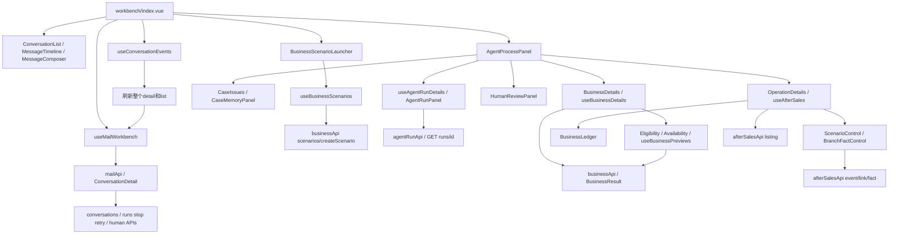

# 邮件工作台解耦范围审查

日期：2026-10-09。审查角色：独立 code-reviewer；依据 `.agents/skills/code-review/SKILL.md`、`.codex/agents/code-reviewer.toml`。

**本轮范围审查，不是全项目验收。** 本轮仅排查邮件交互、Agent 展示、业务查询/售后展示、模拟控制之间的职责、依赖和状态边界。未改源码、已有需求/架构/阶段报告；未创建业务数据、推进模拟事件、调用模型或执行修复。原 Phase 验证与模型质量结论保持原样。

审查期间用户已确认“独立 Agent 运行台，从邮件一键跳转”。该入口方向已确定；业务记录与模拟控制的具体拆分以及实施顺序仍为下述建议。主 Agent 的方案汇总见 [WORKBENCH-DECOUPLING-PROPOSAL.md](../planning/WORKBENCH-DECOUPLING-PROPOSAL.md)。

## 1. 结论与证据等级

1. **交互职责确实集中在邮件工作台。** 场景创建嵌入客户列表；右侧 `AgentProcessPanel` 聚合运行、案件、业务查询、售后账本、模拟控制和人工处理。这符合旧设计，却不符合本次用户提出的职责分离方向。证据：[工作台](../../globalmail-agent/frontend/src/views/mail-agent/index.vue):32–34、122–134，[处理面板](../../globalmail-agent/frontend/src/components/mail-agent/AgentProcessPanel.vue):71–90；旧要求 [Product-Spec](../../Product-Spec.md):575–580。
2. **没有证据支持“生产组件硬编码了场景客户/订单/预填 Agent 回复”。** 当前业务数据来自真实 HTTP 查询；场景数据由后端从允许的初始资料装载进独立 PostgreSQL 分支，之后查询和模拟写入都访问持久账本。数据是模拟来源，服务与持久化是真实实现。证据：[business-api](../../globalmail-agent/frontend/src/api/business-api.ts):14–43，[FixturePackage](../../globalmail-agent/backend/src/globalmail_agent/adapters/fixture_loader.py):26–61，[FixtureConversations](../../globalmail-agent/backend/src/globalmail_agent/application/fixture_conversations.py):28–55，[fixture_ledger](../../globalmail-agent/backend/src/globalmail_agent/adapters/fixture_ledger.py):10–71。
3. **状态已有局部分离，但刷新和生命周期仍绑定邮件页面。** 业务、售后、run 明细有自己的加载/错误状态；SSE 回调统一重读整个会话及列表，并使展开的 run 重读，版本变化还触发业务/售后重读。不能把它说成所有模块共用一个 loading，也不能据此认定已发生串单。证据：[useMailWorkbench](../../globalmail-agent/frontend/src/composables/useMailWorkbench.ts):17–23、49–104，[useAgentRunDetails](../../globalmail-agent/frontend/src/composables/useAgentRunDetails.ts):10–14、42–66，[useAfterSales](../../globalmail-agent/frontend/src/composables/useAfterSales.ts):8–18、117–119，[工作台](../../globalmail-agent/frontend/src/views/mail-agent/index.vue):223–226。
4. **完整模型调用调试不能仅靠把面板搬到另一个页签。** 当前前端契约只有结构化理解、工具、引用、结果、等待和累计用量，没有逐次 Prompt/模型响应/供应商思考内容字段。旧 Spec 明确“不要求展示或存储模型隐藏思维链”，因此新增需求不能直接记为旧实现违规。证据：[AgentRunDetail](../../globalmail-agent/frontend/src/api/agent-run-contract.ts):95–104，[AgentRunPanel](../../globalmail-agent/frontend/src/components/mail-agent/AgentRunPanel.vue):45–118，[Product-Spec](../../Product-Spec.md):402–403。后端模型调用与持久化缺口由主 Agent 另行审查，本报告不重复判定。

证据等级：**源码证实**表示依赖/状态/条件分支可直接定位；**只读实测**表示本轮真实 GET 或浏览器观察；**结构风险**表示可由代码推导的受影响路径，但本轮未在含业务数据的页面复现。以下不把结构风险写成已经发生的业务故障。

## 2. 审查规划及完成情况

| 步骤 | 完成标准 | 本轮结果 |
|---|---|---|
| 读取需求与基线 | 读取规则、Spec、架构、开发计划、索引与交接；明确旧设计和新诉求 | 已读取相关原文；[DEV-PLAN](../../DEV-PLAN.md):15 说明无独立设计稿/Brief，继承 Art Design Pro |
| 追依赖与数据来源 | 页面→组件→composable→DTO/API→数据装载可定位 | 完成，见第 4、5 节 |
| Stage 1 范围对照 | 逐项列出范围内条款，区分匹配、延期/未覆盖和新需求 | 完成，未发现本轮新增 HIGH；不宣布产品 AC 通过 |
| Stage 2 结构与状态 | 区分真实共享状态、局部分离、刷新放大及卸载风险 | 完成，见第 6 节 |
| 只读视觉/运行检查 | 实际查看工作台和邻居页，不产生业务写入 | 完成空状态/邻居渲染对照；丰富态未覆盖 |
| 提出边界和迁移验收 | 可独立实施，保持同一后端账本和服务契约 | 完成，见第 8 节；方案未实施 |

## 3. Stage 1：旧 Spec 合规与新诉求差距

本轮 Stage 1 的判断限于界面组织、数据入口及跨模块契约；未发现这部分新增 HIGH，进入 Stage 2。模型质量、交易正确性、删除、Langfuse 完整验收不在本轮声明通过。延期状态以 [DEV-PLAN](../../DEV-PLAN.md):3、226–253 为准。

| 条款（逐项范围说明） | 源码结论 | 实现/限制证据 |
|---|---|---|
| REQ-008 第1项：运行/工具/引用/回复/耗时/token记录 | 前端已有读取与展示；模型/资料版本等全量记录正确性未在本轮验证 | [AgentRunPanel](../../globalmail-agent/frontend/src/components/mail-agent/AgentRunPanel.vue):3–9、45–118；[AgentRunDetail](../../globalmail-agent/frontend/src/api/agent-run-contract.ts):95–104 |
| REQ-008 第2项：简短说明及可验证工具记录，不要求隐藏思维链 | 源码匹配旧方向；Prompt及实际思考内容为本次新增诉求 | [AgentToolRecords](../../globalmail-agent/frontend/src/components/mail-agent/AgentToolRecords.vue):12–28；[Product-Spec](../../Product-Spec.md):403 |
| REQ-008 第3项：会话串行及旧回复栅栏 | 属后端执行契约，本轮不验证；前端共享busy不能替代此保证 | [useMailWorkbench](../../globalmail-agent/frontend/src/composables/useMailWorkbench.ts):130–166；[AGENT-ARCHITECTURE](../../AGENT-ARCHITECTURE.md):129、396 |
| REQ-008 第4项：停止、重试、刷新恢复入口 | 源码存在入口；本轮未执行停止/重试或重启含数据会话 | [AgentProcessPanel](../../globalmail-agent/frontend/src/components/mail-agent/AgentProcessPanel.vue):21–27、134–146；[useMailWorkbench](../../globalmail-agent/frontend/src/composables/useMailWorkbench.ts):253–255 |
| REQ-008 第5项：技术错误明确呈现 | 邮件、run、业务、售后各有错误呈现；动态错误未本轮实测 | [工作台](../../globalmail-agent/frontend/src/views/mail-agent/index.vue):58–82；[AgentRunPanel](../../globalmail-agent/frontend/src/components/mail-agent/AgentRunPanel.vue):11–31；[OperationDetails](../../globalmail-agent/frontend/src/components/mail-agent/OperationDetails.vue):6–8 |
| REQ-008 第6项：预算、无进展限制 | 用量/预算展示存在；预算执行正确性不在本轮范围 | [AgentRunPanel](../../globalmail-agent/frontend/src/components/mail-agent/AgentRunPanel.vue):99–118 |
| REQ-008 第7项：售后去重、未知结果核对、不抹账 | 当前挂载期间保留原命令并提供核对；后端锁/去重可定位，动态执行未验证；卸载风险见R4 | [useAfterSales](../../globalmail-agent/frontend/src/composables/useAfterSales.ts):40–104；[SimulationControlService](../../globalmail-agent/backend/src/globalmail_agent/application/simulation_control.py):31–76 |
| REQ-009 第1项：复用Art Design Pro、三栏及右侧处理/人审 | 源码匹配旧设计；职责过度聚合属于新方案要改变的产品边界 | [工作台](../../globalmail-agent/frontend/src/views/mail-agent/index.vue):6–12、85–104、117–157 |
| REQ-009 第2项：辨认模式、客户、来信、状态 | 对应绑定存在；本轮空列表只能实测空状态 | [工作台](../../globalmail-agent/frontend/src/views/mail-agent/index.vue):43–48；[AgentProcessPanel](../../globalmail-agent/frontend/src/components/mail-agent/AgentProcessPanel.vue):10–16 |
| REQ-009 第3项：过程与邮件分离、候选对照独立 | 邮件组件只接messages；历史对照、工具、引用留处理面板 | [工作台](../../globalmail-agent/frontend/src/views/mail-agent/index.vue):85–104；[AgentProcessPanel](../../globalmail-agent/frontend/src/components/mail-agent/AgentProcessPanel.vue):48–69；[AgentRunPanel](../../globalmail-agent/frontend/src/components/mail-agent/AgentRunPanel.vue):72–90 |
| REQ-009 第4项：来源文字/图标 | 业务来源、模拟/快照及历史对照有文字标记；全状态可读性未实测 | [BusinessDetails](../../globalmail-agent/frontend/src/components/mail-agent/BusinessDetails.vue):29–35；[BusinessOrderCard](../../globalmail-agent/frontend/src/components/mail-agent/BusinessOrderCard.vue):8–16；[business-format](../../globalmail-agent/frontend/src/components/mail-agent/business-format.ts):36–48 |
| REQ-009 第5项：明确操作按钮 | 来信、回放、人审、停止/重试、结案源码存在；重置/删除仍为Phase12，不借历史验证声称已完成 | [MessageComposer](../../globalmail-agent/frontend/src/components/mail-agent/MessageComposer.vue):11–18、63；[HumanReviewPanel](../../globalmail-agent/frontend/src/components/mail-agent/HumanReviewPanel.vue):109–113、141–143；[DEV-PLAN](../../DEV-PLAN.md):240–253 |
| REQ-010 第1项：最小上下文/禁用答案 | 初始场景装载按白名单保留字段，非整包故事；模型实际上下文由主Agent检查 | [FixturePackage](../../globalmail-agent/backend/src/globalmail_agent/adapters/fixture_loader.py):45–61 |
| REQ-010 第2–4项：删除/重置确认、停写、清分支 | Phase12未开始，不作为本轮新增缺陷，也不声明实现 | [DEV-PLAN](../../DEV-PLAN.md):240–253；旧条款[Product-Spec](../../Product-Spec.md):435–437 |
| REQ-010 第5项：rag/dev/eval隔离 | 场景目录只取dev，读取两个初始inputs文件，不读取未来事件和评测答案；完整隔离验收未重跑 | [FixturePackage](../../globalmail-agent/backend/src/globalmail_agent/adapters/fixture_loader.py):45–61；[连续资料说明](../../data/knowledge/v1/scenarios/journeys/README.md):34–35 |
| REQ-010 第6项：逐样本评测、限制说明 | 评测报告/算法不在本次前端耦合范围；不据此评估准确率 | 旧条款[Product-Spec](../../Product-Spec.md):439、444；本轮GET与空页面证据见第7节 |
| REQ-011 第1项：业务覆盖；第4项：资格计算；第7项：补偿互斥 | 仅追界面/API依赖与单账本，不验证七类Agent质量或资格/互斥计算结果 | [BusinessDetails](../../globalmail-agent/frontend/src/components/mail-agent/BusinessDetails.vue):87–95；[business-api](../../globalmail-agent/frontend/src/api/business-api.ts):20–31 |
| REQ-011 第2项：生产/历史/Mock来源区分 | 源码有来源标记，场景为独立分支；数据标签与业务UI拥挤应分开判断 | [BusinessDetails](../../globalmail-agent/frontend/src/components/mail-agent/BusinessDetails.vue):29–35；[FixturePackage](../../globalmail-agent/backend/src/globalmail_agent/adapters/fixture_loader.py):21–23、148–155 |
| REQ-011 第3项：Agent内部申请/人工模拟执行分开 | 服务入口分开；界面混在同一处理区，正是新诉求差距 | [after-sales-api](../../globalmail-agent/frontend/src/api/after-sales-api.ts):5–22；[OperationDetails](../../globalmail-agent/frontend/src/components/mail-agent/OperationDetails.vue):15–27；[simulation API](../../globalmail-agent/backend/src/globalmail_agent/api/simulation.py):16–26 |
| REQ-011 第5–6项：执行状态与内部申请分开 | Ledger按内部申请/执行/物流/退件展示；执行字段及版本来自后端 | [BusinessLedger](../../globalmail-agent/frontend/src/components/mail-agent/BusinessLedger.vue):40–44；[OperationLedger](../../globalmail-agent/frontend/src/api/after-sales-contract.ts):11–28 |
| REQ-011 第8项：显式推进、不能向Agent开放 | 明确模拟按钮、确认框、独立simulation路由可定位；本轮不推进、不验证Agent工具注册清单 | [ScenarioControl](../../globalmail-agent/frontend/src/components/mail-agent/ScenarioControl.vue):3–8、85–104；[simulation API](../../globalmail-agent/backend/src/globalmail_agent/api/simulation.py):1、11–26 |
| REQ-011 第9项：HITL业务事件只提示、合法待办恢复 | 事件/等待字段进入ConversationDetail；实际唤醒门不在本轮验证 | [ConversationDetail](../../globalmail-agent/frontend/src/api/mail-agent-contract.ts):98–104；[HumanReviewPanel](../../globalmail-agent/frontend/src/components/mail-agent/HumanReviewPanel.vue):22–29 |
| REQ-011 第10项：继承隔离/预算/UI基线、不连真实交易 | 本轮追到本地模拟服务及同账本；没有发现前端真实交易入口，未进行全仓安全审计 | [after-sales-api](../../globalmail-agent/frontend/src/api/after-sales-api.ts):5–22；[ScenarioControl](../../globalmail-agent/frontend/src/components/mail-agent/ScenarioControl.vue):3–4；[AGENT-ARCHITECTURE](../../AGENT-ARCHITECTURE.md):94 |
| REQ-012 第1–5项及推荐模型 | 结构化诉求/条件/同意/来源与修订字段可展示；语义正确性、schema修复和模型选择由主Agent/历史专项处理，不称COT | [UnderstandingResult](../../globalmail-agent/frontend/src/api/agent-run-contract.ts):9–48；[AgentRunPanel](../../globalmail-agent/frontend/src/components/mail-agent/AgentRunPanel.vue):45–46 |
| REQ-013 第1–7项：Langfuse/版本/usage/脱敏/降级/部署/评测 | 仅有本地累计用量及“观测尚未接入”提示；Phase11未做。新Prompt逐次展示不是当前页面契约已有能力；不由本轮倒改阶段PASS | [AgentRunPanel](../../globalmail-agent/frontend/src/components/mail-agent/AgentRunPanel.vue):99–118；[DEV-PLAN](../../DEV-PLAN.md):226–238；[Product-Spec](../../Product-Spec.md):499–505 |
| REQ-014 第1、7、8、11、12项：图片接收/状态/来源/更正/移除UI交集 | 图片上传和证据抽屉独立组件存在；本轮不上传、更正或撤销，动态能力未覆盖 | [MessageComposer](../../globalmail-agent/frontend/src/components/mail-agent/MessageComposer.vue):55–56；[工作台](../../globalmail-agent/frontend/src/views/mail-agent/index.vue):164–165、232–237 |
| REQ-014 第2–6、9–10项及AC082 | 图文理解、分流、预算、权限/隐私属另一专项；本轮不调用模型，未验这些行为 | 旧条款[Product-Spec](../../Product-Spec.md):518–522、524、526–527、548；[DEV-PLAN](../../DEV-PLAN.md):176–191 |
| 5.10 CMP-001–009、013；5.11加载/错误/受限 | 邮件、Agent、人审、业务、模拟、图片UI均定位；业务/模拟集中处理区符合旧CMP，但与新职责分离方向不同 | [工作台](../../globalmail-agent/frontend/src/views/mail-agent/index.vue):10–165；[AgentProcessPanel](../../globalmail-agent/frontend/src/components/mail-agent/AgentProcessPanel.vue):17–90；[Product-Spec](../../Product-Spec.md):572–584、592–597 |
| 5.10 CMP-010–012；5.12后台输入校验；第7节外部依赖 | 知识编辑/发布/检索和全量校验不在范围；邻居知识页仅作只读视觉对照 | [DEV-PLAN](../../DEV-PLAN.md):123–156；[知识页面](../../globalmail-agent/frontend/src/views/knowledge/index.vue):3–13；[Product-Spec](../../Product-Spec.md):581–583、599–614、676 |

**未发现本范围内额外业务功能属于无依据的 Spec 漂移。** 场景、业务单与模拟控制在旧 CMP-008/009 已有要求；独立“Agent调试”“业务记录”“模拟控制”页面则是本次待确认方案，当前路由不存在，不能描述为已经完成。证据：[Product-Spec](../../Product-Spec.md):579–580，[mail-agent路由](../../globalmail-agent/frontend/src/router/modules/mail-agent.ts):8–27。

## 4. 当前依赖图



| 边 | 实际文件/行号 |
|---|---|
| 页面→邮件状态/API | [index.vue](../../globalmail-agent/frontend/src/views/mail-agent/index.vue):182–226；[useMailWorkbench.ts](../../globalmail-agent/frontend/src/composables/useMailWorkbench.ts):2–4；[mail-agent.ts](../../globalmail-agent/frontend/src/api/mail-agent.ts):4–23 |
| 页面→场景 | [index.vue](../../globalmail-agent/frontend/src/views/mail-agent/index.vue):32–34、258–263；[BusinessScenarioLauncher.vue](../../globalmail-agent/frontend/src/components/mail-agent/BusinessScenarioLauncher.vue):63–80；[useBusinessScenarios.ts](../../globalmail-agent/frontend/src/composables/useBusinessScenarios.ts):14–39 |
| 处理面板→运行 | [AgentProcessPanel.vue](../../globalmail-agent/frontend/src/components/mail-agent/AgentProcessPanel.vue):36–43、126–129；[useAgentRunDetails.ts](../../globalmail-agent/frontend/src/composables/useAgentRunDetails.ts):18–39 |
| 处理面板→业务/售后/人审 | [AgentProcessPanel.vue](../../globalmail-agent/frontend/src/components/mail-agent/AgentProcessPanel.vue):71–90 |
| 业务→查询/条件/库存 | [BusinessDetails.vue](../../globalmail-agent/frontend/src/components/mail-agent/BusinessDetails.vue):87–95、105–126；[useBusinessDetails.ts](../../globalmail-agent/frontend/src/composables/useBusinessDetails.ts):25–42；[business-api.ts](../../globalmail-agent/frontend/src/api/business-api.ts):14–31 |
| 售后→账本及模拟命令 | [OperationDetails.vue](../../globalmail-agent/frontend/src/components/mail-agent/OperationDetails.vue):15–27、45；[useAfterSales.ts](../../globalmail-agent/frontend/src/composables/useAfterSales.ts):24–104；[after-sales-api.ts](../../globalmail-agent/frontend/src/api/after-sales-api.ts):5–22 |

同一 `Conversation` 对象用作 BusinessContext/AfterSalesContext 不意味着后端领域和模型混为一个服务。`ConversationDetail` 聚合了邮件、人审、run、事项、事件与事实，使展示和刷新共同依赖大快照；业务快照和售后账本另有API。证据：[ConversationDetail](../../globalmail-agent/frontend/src/api/mail-agent-contract.ts):90–115，[after-sales-contract](../../globalmail-agent/frontend/src/api/after-sales-contract.ts):29–30，[BusinessQueries](../../globalmail-agent/backend/src/globalmail_agent/application/business_queries.py):72–99。

## 5. “模拟数据”根来源追踪

```text
显式“初始业务场景”按钮
→ useBusinessScenarios.create
→ POST /business/scenarios/{scenario_id}/conversations
→ FixtureConversations.create
→ FixturePackage（data/knowledge/v1中的允许文件）
→ 新dataset、conversation、branch + 初始消息/订单/账本/库存落PG
→ GET conversation/business 和 GET conversation/operations
→ Vue展示真实API返回

人工“确认模拟记录”
→ POST /simulation/branches/{branch_id}/events（或fact/link）
→ 同会话/分支/操作版本及允许事件校验
→ 同一账本更新并产生事件
→ SSE触发前端读取
```

证据：[场景入口](../../globalmail-agent/frontend/src/components/mail-agent/BusinessScenarioLauncher.vue):71–80，[business API](../../globalmail-agent/backend/src/globalmail_agent/api/business.py):36–43，[FixtureConversations](../../globalmail-agent/backend/src/globalmail_agent/application/fixture_conversations.py):29–40，[FixturePackage](../../globalmail-agent/backend/src/globalmail_agent/adapters/fixture_loader.py):10、26–61，[fixture_ledger](../../globalmail-agent/backend/src/globalmail_agent/adapters/fixture_ledger.py):18–71，[SimulationControlService](../../globalmail-agent/backend/src/globalmail_agent/application/simulation_control.py):31–76、125。

- 来源包包含生产商品/价格原型及编写的订单身份、库存、政策、业务事件；这些性质在数据说明中明确，不等同于生产真实订单：[data README](../../data/knowledge/v1/README.md):5–7、44–45。
- 后端只读取两个初始 `inputs.jsonl`，筛选 `usage_split == dev`，抽取初始字段；未在该装载链读取 `controller-events`、`evaluation` 或完整可读故事：[FixturePackage](../../globalmail-agent/backend/src/globalmail_agent/adapters/fixture_loader.py):45–61。不能仅凭这段源码宣布整个模型上下文绝无未来泄漏，本轮未重跑该专项。
- 产品、部件、兼容/政策来自固定服务端文件；路径不接受前端任意参数：[FixturePackage](../../globalmail-agent/backend/src/globalmail_agent/adapters/fixture_loader.py):30–40、63–68。
- 手动会话/历史来源没有匹配业务资料时返回未知/不可用，而非在Vue中补订单：[BusinessQueries](../../globalmail-agent/backend/src/globalmail_agent/application/business_queries.py):52–56、79–87；界面空结果：[BusinessDetails](../../globalmail-agent/frontend/src/components/mail-agent/BusinessDetails.vue):44–47、98。
- 场景创建、查询、内部售后与模拟执行共享已有账本及后端领域规则，拆页面时应保持这一来源：[after_sales_ledger](../../globalmail-agent/backend/src/globalmail_agent/application/after_sales_ledger.py):1–8、34–54。不需要复制一套前端业务账本或另建“模拟业务数据库”。

## 6. Stage 2：耦合与工程风险

| 编号/级别 | 性质 | 发现及影响 | 证据与建议边界 |
|---|---|---|---|
| R1 / MEDIUM | 源码证实：职责聚合 | `AgentProcessPanel`同时包含运行、人审、案件、业务查询和模拟执行；邮件工作台还承担创建场景。开发者调试与客服邮件交互的入口同处一个操作场景。不是由代码重复证明的后台业务耦合。 | [AgentProcessPanel](../../globalmail-agent/frontend/src/components/mail-agent/AgentProcessPanel.vue):71–90；[index](../../globalmail-agent/frontend/src/views/mail-agent/index.vue):32–34。拆只读Agent视图、业务视图、模拟写入口；人审保留邮件语境。 |
| R2 / MEDIUM | 源码证实：刷新放大；性能/闪烁为结构风险 | 每个有效SSE刷新整份detail和list；替换detail使所有展开run重读，run面板加载时隐藏已读内容。业务/售后又按row/input版本重读。多个模块的更新无法按事件种类定向分发。没有本轮请求瀑布、耗时或丰富态闪烁实测。 | [index](../../globalmail-agent/frontend/src/views/mail-agent/index.vue):223–226；[useAgentRunDetails](../../globalmail-agent/frontend/src/composables/useAgentRunDetails.ts):42–66；[AgentRunPanel](../../globalmail-agent/frontend/src/components/mail-agent/AgentRunPanel.vue):33–34；[useBusinessDetails](../../globalmail-agent/frontend/src/composables/useBusinessDetails.ts):56–71；[useAfterSales](../../globalmail-agent/frontend/src/composables/useAfterSales.ts):117–119。保留scope校验/去重，用事件kind+资源ID做定向失效。 |
| R3 / MEDIUM | 源码证实：邮件命令共享busy；交互影响可由源码判断 | 添加来信、保存人审、停止/重试、结案、创建/导入共享邮件busy，且busy延续至详情/列表刷新完成。读刷新迟缓也会延长整个邮件操作区禁用。业务/售后的busy并不使用这个变量，不能说它们全部一起锁住。 | [useMailWorkbench](../../globalmail-agent/frontend/src/composables/useMailWorkbench.ts):130–188；[index](../../globalmail-agent/frontend/src/views/mail-agent/index.vue):18、97、247；[HumanReviewPanel](../../globalmail-agent/frontend/src/components/mail-agent/HumanReviewPanel.vue):58、110–113；[useAfterSales](../../globalmail-agent/frontend/src/composables/useAfterSales.ts):10。按命令/目标资源管理请求状态，仍以服务端版本/处理权门禁为准。 |
| R4 / MEDIUM | 源码证实：状态存于被销毁面板；恢复风险未动态复现 | 紧凑布局的处理抽屉destroy-on-close，宽窄切换也卸载处理面板。售后未确认命令、PendingCommands和模拟表单在组件/composable内存中；销毁后原key/payload和核对入口随实例消失。关闭/重开抽屉存在丢失“未知结果核对”状态的路径。本轮未发送模拟命令，不宣称已重复执行或赔付。 | [index](../../globalmail-agent/frontend/src/views/mail-agent/index.vue):117–157；[OperationDetails](../../globalmail-agent/frontend/src/components/mail-agent/OperationDetails.vue):45、57；[useAfterSales](../../globalmail-agent/frontend/src/composables/useAfterSales.ts):16、23、79、120–124；[ScenarioControl](../../globalmail-agent/frontend/src/components/mail-agent/ScenarioControl.vue):80–82；[PendingCommands](../../globalmail-agent/frontend/src/api/mail-agent-request.ts):72–88。将未确认命令及表单生命周期提升到模拟模块/分支会话状态，界面关闭不销毁恢复依据。 |
| R5 / LOW | 源码证实：重复展示 | 订单卡逐行展示BusinessLedger，售后区再展示整个Ledger；二者来自不同读投影但同账本。是重复信息和视图选择边界，不是两份后台交易数据。 | [BusinessOrderCard](../../globalmail-agent/frontend/src/components/mail-agent/BusinessOrderCard.vue):46–47；[OperationDetails](../../globalmail-agent/frontend/src/components/mail-agent/OperationDetails.vue):16；[BusinessQueries](../../globalmail-agent/backend/src/globalmail_agent/application/business_queries.py):77；[after_sales_ledger](../../globalmail-agent/backend/src/globalmail_agent/application/after_sales_ledger.py):34–54。业务页统一详情，邮件/Agent只给摘要和跳转。 |
| R6 / LOW | 源码证实：层次依赖 | composable导入components目录下的校验、上下文key、业务错误格式；重用状态模型时被展示目录牵引。没有发现这些函数访问组件实例，但位置削弱模块边界。 | [useMailWorkbench](../../globalmail-agent/frontend/src/composables/useMailWorkbench.ts):5–6；[useBusinessDetails](../../globalmail-agent/frontend/src/composables/useBusinessDetails.ts):4；[useAfterSales](../../globalmail-agent/frontend/src/composables/useAfterSales.ts):5。共享类型/验证/context-key归领域或API模块，展示格式留presenter。 |

### 6.1 已有隔离，不能误判成缺陷

| 检查 | 源码证据 | 限制 |
|---|---|---|
| 列表、邮件detail、业务、售后、run错误/加载各自管理 | [useMailWorkbench](../../globalmail-agent/frontend/src/composables/useMailWorkbench.ts):17–23；[useBusinessDetails](../../globalmail-agent/frontend/src/composables/useBusinessDetails.ts):12–15；[useAfterSales](../../globalmail-agent/frontend/src/composables/useAfterSales.ts):8–13；[useAgentRunDetails](../../globalmail-agent/frontend/src/composables/useAgentRunDetails.ts):10–14 | 无证据表明业务只读错误会使邮件请求状态变为失败 |
| 来信/人审草稿按会话保存，刷新不直接清空 | [useMailWorkbench](../../globalmail-agent/frontend/src/composables/useMailWorkbench.ts):25–40、74–98、191–224 | 不同于R4模拟表单随面板销毁；本轮未输入业务文本 |
| 旧读取结果有代次/作用域校验 | [useMailWorkbench](../../globalmail-agent/frontend/src/composables/useMailWorkbench.ts):64–104；[useBusinessDetails](../../globalmail-agent/frontend/src/composables/useBusinessDetails.ts):28–41；[useAgentRunDetails](../../globalmail-agent/frontend/src/composables/useAgentRunDetails.ts):21–39；[useAfterSales](../../globalmail-agent/frontend/src/composables/useAfterSales.ts):25–37 | 不把“共用context”直接说成跨客户显示错误 |
| SSE校验会话/工作区/分支/模式，切换取消旧流 | [conversation-event-session](../../globalmail-agent/frontend/src/composables/conversation-event-session.ts):20–40、66–83 | 新架构仍需保留这些校验，不能用无scope全局bus替代 |
| 历史模拟写入有前后端限制，允许操作来自服务端 | [OperationDetails](../../globalmail-agent/frontend/src/components/mail-agent/OperationDetails.vue):17–18；[useAfterSales](../../globalmail-agent/frontend/src/composables/useAfterSales.ts):42、67；[ScenarioControl](../../globalmail-agent/frontend/src/components/mail-agent/ScenarioControl.vue):8；[SimulationControlService](../../globalmail-agent/backend/src/globalmail_agent/application/simulation_control.py):31–47、74–76 | 不是权限体系全验收；本轮无写入反例 |

### 6.2 代码质量、测试与安全

- 计数：工作台277行、AgentProcessPanel148行、BusinessDetails127行、OperationDetails65行、useMailWorkbench300行、useAgentRunDetails77行、useAfterSales127行、useBusinessDetails88行。核心文件没有超300行，但行数合格不能抵消R1职责聚合。文件见第4节链接。
- 本轮定向扫描上述工作台/components、相关composable及API：`any`、`eval(`、`innerHTML`、`dangerouslySetInnerHTML`、`VITE_.*KEY|SECRET|TOKEN`、常见密钥前缀/环境键，匹配文件数均为0。范围扫描不是全仓密钥/SQL/后端安全验收。纯文本工具参数展示见[AgentToolRecords](../../globalmail-agent/frontend/src/components/mail-agent/AgentToolRecords.vue):26–28；白名单场景文件读取见[FixturePackage](../../globalmail-agent/backend/src/globalmail_agent/adapters/fixture_loader.py):63–68。
- 现有测试包含会话切换/晚到响应、同key未知结果重试、SSE同版本重读；不是只存在测试文件。已阅读但本轮未重跑：[mail-workbench.test](../../globalmail-agent/frontend/scripts/mail-workbench.test.ts):76–118，[agent-run.test](../../globalmail-agent/frontend/scripts/agent-run.test.ts):65–118，[after-sales.test](../../globalmail-agent/frontend/scripts/after-sales.test.ts):103–182。
- 测试盲区：上述售后用例测试保持同一composable实例时的未知结果重试和跨会话清理，没有验证实际处理抽屉关闭、宽窄切换、重新挂载后原命令核对状态恢复；R4需增加组件生命周期验收。证据：[after-sales.test](../../globalmail-agent/frontend/scripts/after-sales.test.ts):103–182，[index](../../globalmail-agent/frontend/src/views/mail-agent/index.vue):117–157。

## 7. 本轮只读实测、视觉与编译边界

真实GET `http://127.0.0.1:18080/api/v1/conversations` 原始输出：

```text
200
{"code":200,"msg":"ok","data":{"items":[],"next_cursor":null},"request_id":"3326de37-b6fa-4d15-b435-94c7f6ad1521"}
```

真实GET `/api/v1/business/scenarios` 的本轮计数输出（以下为响应字段的统计，不是完整原响应）：

```json
{
  "http": 200,
  "code": 200,
  "scenario_count": 72,
  "mode_counts": [
    { "Name": "historical_replay", "Count": 1 },
    { "Name": "interactive_simulation", "Count": 71 }
  ]
}
```

对应服务源码：[business API](../../globalmail-agent/backend/src/globalmail_agent/api/business.py):36–38、[QueryMixin](../../globalmail-agent/backend/src/globalmail_agent/application/conversation_queries.py):26–49。这仅证明当前空会话/可读取目录，不证明72场景已执行、业务正确或不存在隐藏数据。

本轮使用临时后台浏览器页只读打开 `/#/workbench` 并通过侧栏进入 `/#/knowledge`，查看实际截图/可访问树；未点击创建、导入、运行、试查/Embedding、模拟控制。临时页已关闭。

- 工作台实际显示空会话、查看模式/处理状态筛选、三个创建/导入入口和邮件空提示；没有伪造订单/邮件填充。对应源码：[index](../../globalmail-agent/frontend/src/views/mail-agent/index.vue):10–35、106–115。
- 1280×720默认截图中内容区不足1024px，右侧面板被紧凑规则折叠；无选中会话不展示“处理详情与人审”按钮。说明当前窗口下用户不会持续看到Agent处理栏，与“主要体现Agent”的新诉求有差距。对应源码：[index](../../globalmail-agent/frontend/src/views/mail-agent/index.vue):55、117–119、229–230。并非旧响应式规则不合规：[Product-Spec](../../Product-Spec.md):586。
- 邻居知识页与工作台均使用现有外壳、浅色卡片、Element按钮、同一RuntimeStatus；截图未见新引入另一套外观体系。对应源码：[index](../../globalmail-agent/frontend/src/views/mail-agent/index.vue):3、6、52；[知识页](../../globalmail-agent/frontend/src/views/knowledge/index.vue):3–13。这里只对照了当前浅色空工作台和邻居列表，未验明暗/窄屏/富内容细节，也未作设计数值或像素差比较。
- 正式服务当前0会话，不能查看实际Agent运行、工具、Prompt/思考或售后控制丰富态。因此R1/R2/R4主要为源码审查，不宣称运行页面已经复现缺陷。

**编译：本轮未执行 `pnpm build`、vue-tsc、后端编译或测试运行，无本轮原始编译输出。** 历史Phase记录保留，不作为本轮构建PASS证据。本任务无源码变更，未额外生成编译产物。

## 8. 解耦方案与实施边界（建议，未实施）

### 8.1 页面职责

| 页面/入口 | 承担职责 | 组件/API复用 | 可独立验收标准 |
|---|---|---|---|
| 邮件工作台 | 客户/邮件往来、来信/回放、人审回复和结案；保留明显的Agent状态、最新行动摘要及“查看本轮运行”入口 | [ConversationList/Timeline/Composer](../../globalmail-agent/frontend/src/views/mail-agent/index.vue):10–104；[HumanReviewPanel](../../globalmail-agent/frontend/src/components/mail-agent/HumanReviewPanel.vue):32–143；mailApi | 未打开业务页/模拟台也能正常收录来信、看邮件、完成人审；业务接口失败不覆盖邮件错误；常用窗口仍能识别Agent在做什么 |
| Agent运行详情/调试 | 按conversation/run查看本轮事件时间线、逐次模型调用、Prompt/工具定义、实际输入输出、供应商实际返回的思考（可用时）、工具参数/结果、引用、提交/拒绝原因及用量 | [AgentRunPanel](../../globalmail-agent/frontend/src/components/mail-agent/AgentRunPanel.vue):45–118；[AgentToolRecords](../../globalmail-agent/frontend/src/components/mail-agent/AgentToolRecords.vue):12–28；agentRunApi；新增调用记录由主Agent方案定义 | mail→run可定位；刷新恢复同一记录；明确区分实际返回、未启用、未返回、未记录；不把理解摘要改名为思维链；不用重跑Agent补历史缺失 |
| 业务记录 | 客户/订单/商品行、内部申请、执行单、物流、退件、政策与客户选择的只读查询 | [BusinessOrderCard](../../globalmail-agent/frontend/src/components/mail-agent/BusinessOrderCard.vue):8–47；[BusinessLedger](../../globalmail-agent/frontend/src/components/mail-agent/BusinessLedger.vue):32–44；businessApi/operations读API | 可通过显式conversation/order/line/operation定位；同一backend账本；不要求先挂载邮件处理面板才能查看 |
| 模拟控制台 | 开发者选/建场景，独立推进合法执行/业务事实、核对未知结果和关联执行单 | [BusinessScenarioLauncher](../../globalmail-agent/frontend/src/components/mail-agent/BusinessScenarioLauncher.vue):68–80；[ScenarioControl](../../globalmail-agent/frontend/src/components/mail-agent/ScenarioControl.vue):85–119；[BranchFactControl](../../globalmail-agent/frontend/src/components/mail-agent/BranchFactControl.vue):66–72；simulation写API | 与邮件/Agent展示分开；分支/申请选择明确；关闭视图后仍能恢复未确认原命令；模拟成功不冒充真实履约 |

本次新增页面需更新 [Product-Spec](../../Product-Spec.md):419–423、568–586、403、499–503 及 [DEV-PLAN](../../DEV-PLAN.md):284–288 对应交付边界。只拆页面不变业务范围、历史隔离、HITL、单账本和Agent工具授权；模型观测记录的隐私/删除影响由主Agent统一纳入架构。当前[路由](../../globalmail-agent/frontend/src/router/modules/mail-agent.ts):8–27只有邮件、知识、系统状态，以上独立入口尚不存在。

### 8.2 模块状态与组件边界

1. **邮件状态模块**维护选择、可见邮件、人审稿、来信草稿与邮件命令；**run模块**按run ID维护记录和选中调用；**业务模块**按conversation/order/line维护只读投影；**模拟模块**按branch/operation维护表单、未确认命令与请求key。依据是当前已有分开的composable：[useMailWorkbench](../../globalmail-agent/frontend/src/composables/useMailWorkbench.ts):8–45、[useAgentRunDetails](../../globalmail-agent/frontend/src/composables/useAgentRunDetails.ts):6–16、[useBusinessDetails](../../globalmail-agent/frontend/src/composables/useBusinessDetails.ts):6–18、[useAfterSales](../../globalmail-agent/frontend/src/composables/useAfterSales.ts):7–23。拆组织结构，不重新造数据服务。
2. 展示组件尽量接受稳定的只读数据和ID，发出明确意图；业务查询与模拟写控制不再由`AgentProcessPanel`创建。`BusinessLedger`、订单卡、工具记录可保留复用；当前`OperationDetails`的只读账本和写控制需拆开，而非整体搬走。[OperationDetails](../../globalmail-agent/frontend/src/components/mail-agent/OperationDetails.vue):15–27、[BusinessLedger](../../globalmail-agent/frontend/src/components/mail-agent/BusinessLedger.vue):32–44。
3. 共享的是会话/分支/运行ID和受验证事件，避免共享整份`ConversationDetail`作为所有模块的刷新开关。保留`workspace/branch/mode`作用域与seq去重；事件按kind和资源ID通知相关模块，必要时兜底全量刷新。[conversation-event-session](../../globalmail-agent/frontend/src/composables/conversation-event-session.ts):20–40、66–83；[ConversationEvent](../../globalmail-agent/frontend/src/api/mail-agent-contract.ts):127–135。具体失效规则须先核当前后端事件类别，不凭空约定API。
4. 未确认命令恢复状态不能归属于会被关闭/布局切换销毁的卡片；不得仅通过放开多个按钮并发来“解耦”。仍带原idempotency key、原payload、资源版本；本地生命周期保留与服务端幂等/版本栅栏分别验证。[PendingCommands](../../globalmail-agent/frontend/src/api/mail-agent-request.ts):71–92；[useAfterSales](../../globalmail-agent/frontend/src/composables/useAfterSales.ts):54–59、76–104；[SimulationControlService](../../globalmail-agent/backend/src/globalmail_agent/application/simulation_control.py):31–76。

### 8.3 建议实施顺序

| 顺序 | 交付 | 完成标准 |
|---|---|---|
| 1 | 落实已确认的独立Agent入口，明确其余边界，更新源文档 | 邮件一键跳转Agent运行台；业务/模拟入口与观测内容定义清楚；先区分Prompt、供应商思考、结构化理解、工具事实；不覆盖旧Phase报告 |
| 2 | 拆只读业务展示与模拟写入口 | 同API同账本，原按钮/授权不丢；正常邮件页面不挂载模拟控制；深链接有明确scope与错误恢复 |
| 3 | 提升模拟命令/表单生命周期，拆请求状态 | 抽屉关闭、布局切换、会话切换/返回后能核对未知原命令；业务/run读取失败不会覆盖邮件输入或命令状态 |
| 4 | 独立Agent运行视图及模型调用记录 | 完整逐次调用来自后端真实记录；历史缺失明确显示，未返回思考不补造；媒体/敏感字段、撤销和删除契约同步 |
| 5 | 按事件定向刷新，做本期工程验收 | SSE scope/seq/晚到保护保留；run更新不反复重读无关旧run/业务；丰富态明暗/宽窄/邻居对照；构建、必要组件生命周期/错误路径及实际功能验证有本期原始证据 |

本轮止于排查与方案，以上步骤未执行。本报告不请求升级真实ERP/邮件接入，也不把现有模拟资料改标签冒充真实业务。
